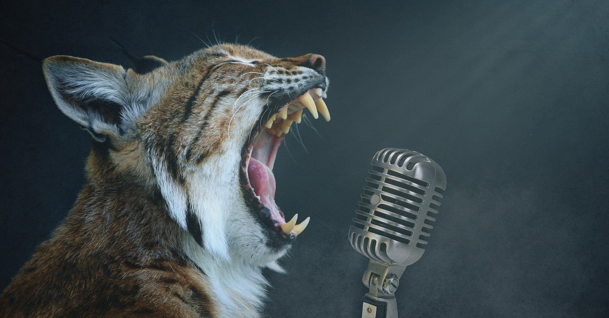

<figure>

</figure>

　ほぼ毎日noteに記事を書いているように、ほぼ毎日YouTubeにゲームプレイ動画をアップロードしている。

　以前もnoteで記事にしたが、昔からゲームプレイを録画するのが好きで、いわばゲームプレイログのような意味合いで、YouTubeに動画を残している感じだ。

　YouTubeのゲーム動画と言えば、現在はゲームをプレイするものが自らプレイの状況を語りながら遊ぶ、「ゲーム実況」が主だが、プレイログなので今のところ自分の声は入れていない。

　思い返すと、YouTubeもニコニコ動画もなかった時代（今から15年ぐらい前）に、ネット上の大型掲示板をコミュニティ母体として、P2Pでネット上の互いのパソコンを直接繋ぐ方法で、ゲーム実況をしていたこともある。その頃は、動画自体を録画して残す場所（サービス）がなかったので、実況してその場で終わりだった。

　今は、自分で遊んだゲームを、世にあるYouTube動画のように丁寧な編集を施すこともなく、ほとんどそのままアップロードするだけ。まさにプレイログ以外の何者でもない。

　しかし、最近は録画して、改めてアップロードする、その手間すら惜しんで、ゲームプレイをライブでYouTubeに流し、それを残しているだけのことも多くなっている。

　ライブでそのままやりっぱなし、アップロードしっぱなしの方が、手間は省けて簡単なのだが、例えばオンラインのゲームなんかだと、若干マッチングの時間などが編集されずに残る。見るときに少し冗長になる。しかし、それでもゲームによってはそれでもいいか、という感じでライブ録画に頼っている。

　ところが、ライブでゲームを遊ぶと、ありがたいことにリアルタイムでそれを視聴して、なんとコメントまでしてくださる方々がいらっしゃる。昔ゲーム実況していたからわかるが、これはこれで楽しい。しかし、前述したとおりただのゲームプレイログなので、マイクも入れず、コメントしてくれたユーザーとは、コメント欄でやりとりしている。

　普段オンラインゲームを遊ぶときは、ボイスチャットを利用することもあるので、マイクも用意してあって、いつでも肉声で話すことは可能なのだが、後でプレイログ見たときに声入っているのがどうなのか、まだ悩ましいところはある。ユーチューバーのように気の利いたことは言えないので、ただの雑談になってしまうだろう。

　そんなことを考えると、ライブ録画に移行しつつある今、どういうプレイスタイルでログを残すのが正解か、ちょっと悩ましい。

　プレイログ残してどうするの？　という疑問も浮かぶかもしれないが、これはもう一種のライフワークになっているので仕方ない。そこに対する疑問は払拭した上で、ライブ録画の方法を悩んでいる。

　余談だが、YouTubeは再生回数か、あるいは他の理由で、アップロードした動画の画質があまりよくないことがある。高画質（1080p 60fps）で動画をアップロードできる他のサービスもあるといいのに、などと考えている今日この頃だ。

[https://www.youtube.com/watch?v=3\_DDt\_gaanY](https://www.youtube.com/watch?v=3_DDt_gaanY)
