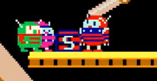

<figure>

</figure>

　botを作って、過去に書いたnoteの記事を宣伝するようにしたら、[昔のゲーセンの思い出を書いた記事](https://note.com/keigox68000/n/n96a79eae8882)が好評だったので第２弾を書こう。またまたすべて長野市にあったゲーセンの話だ。

## 『シルバーコイン』

　前回紹介した**『ダイエー』**の駐車場１階にテナントとして入っていたゲームセンターが**『シルバーコイン』**。今から考えると、ダブルクレイドル筐体が入っていた**『ダイエー』**もすごいのに、その駐車場に、さらに気合いの入ったゲーセンが入居していたのだから、当時のゲーセンの勢いが伺われるというものだ。比較的広い店内は、まるでスナックやバーのような照明でいつでも薄暗く、いかにも昭和のゲーセンの雰囲気だった。店を入った入口付近に、**『アストロンベルト』『バトルゾーン』『ダライアス』『アウトラン』『サイバータンク』**などの大型筐体を配置し、あとはテーブル筐体が数十台並ぶ清々しいレイアウトの店内が印象に残っている。店の片隅にはバーカウンターのような場所があり、カップラーメンやソフトクリームを注文できた。現在も駐車場は残っているが、ゲーセンだった場所は会社の事務所になっている。

[https://www.google.com/maps/@36.6494983,138.1859262,3a,45.8y,13.53h,99.8t/data=!3m6!1e1!3m4!1sY1yBRPrVBMKsodE24RXlFg!2e0!7i16384!8i8192](https://www.google.com/maps/@36.6494983,138.1859262,3a,45.8y,13.53h,99.8t/data=!3m6!1e1!3m4!1sY1yBRPrVBMKsodE24RXlFg!2e0!7i16384!8i8192)

## 『ダイヤ』

　前回紹介した**『NASA』**の近くで営業していたゲーセンだ。旧店名は『シルバールーフ』で、その名の通り、銀色の屋根の店だった。店内は広いのだが、余裕たっぷりに筐体が置いてあり、今で言うなら、あまり密にならずに遊べるような店だった。店が広いので、**『ダライアス』や『ダライアスII』**がいち早く入荷していたのも印象的だった。ゲーム数があまり多くなかったので、それほど通わなかったかな。現在はファミリーマート。

[https://www.google.com/maps/@36.6397201,138.2123468,3a,75y,148.08h,92.19t/data=!3m6!1e1!3m4!1sJRulImOtOrzfFO9Uca\_aQA!2e0!7i16384!8i8192](https://www.google.com/maps/@36.6397201,138.2123468,3a,75y,148.08h,92.19t/data=!3m6!1e1!3m4!1sJRulImOtOrzfFO9Uca_aQA!2e0!7i16384!8i8192)

## 『バスストップ』

　長野駅前中央通りにあったゲームセンター。店名の由来は、店の前がバス停だったから……に違いない。通りにそって縦長の店で、そう広くない店内には、テーブル筐体をメインに、**『スペースハリアー』**などの大型筐体を無理やり入れてあるというスパルタンなゲーセンだった。ゲームの数は多くなかったが、その代わりマニアックな人がいて、新製品ゲームを早々にクリアする人が見られたりした。僕はここで、**『ファンタジーゾーン』**の上手い人のプレイを見て、パパオパの腕抜けなどを覚えた記憶がある。現在は駐車場になっていて、バス停は残っている。

[https://www.google.com/maps/@36.6448067,138.1865669,3a,49y,271.42h,94.86t/data=!3m7!1e1!3m5!1sVh6MwPG5ky4x1taPXWUa5A!2e0!5s20190601T000000!7i16384!8i8192](https://www.google.com/maps/@36.6448067,138.1865669,3a,49y,271.42h,94.86t/data=!3m7!1e1!3m5!1sVh6MwPG5ky4x1taPXWUa5A!2e0!5s20190601T000000!7i16384!8i8192)

## 『ビデオラマ』

　上で紹介した**『バスストップ』**の向かい。お菓子のダイトーの2階にあった店。タイトー系列で、店の入口には**『タイムギャル』**や**『忍者ハヤテ』**の等身大ポップが置かれている時期もあった。タイトー系列なので、**『ダライアス』**はもちろん、市内では珍しかった**『ナイトストライカー』**や**『ミッドナイトランディング』『コンチネンタルサーカス』**などもいち早く入荷していた。それでいて、**『ギャラクシーフォースII』**や**『スターウォーズ（アタリ）』**、**『アイ、ロボット』**など、他社大型筐体のゲームも置いてあった。店内が広く、テーブル筐体がおそらく80台ぐらい設置してあったような気がする。当時を経験している人ならわかるが、タイトーテーブルでボタンが押しにくいのが難点だった。それにも関わらず、ここで多くのゲームをクリアできたのは、ほとんどのゲームが1プレイ50円だったからだ。ピンボールも10台以上並べていて、僕のピンボール好きはこの頃に始まったものだ。コインづまりを指摘するとキレる、謎の老人が店番していることは仲間内で有名であった。現在はネットカフェになっている。

[https://www.google.com/maps/@36.6452712,138.1866668,3a,75y,96.24h,104.36t/data=!3m7!1e1!3m5!1s22CpawhZ0jVkfo-Rr1bqJw!2e0!5s20190601T000000!7i13312!8i6656](https://www.google.com/maps/@36.6452712,138.1866668,3a,75y,96.24h,104.36t/data=!3m7!1e1!3m5!1s22CpawhZ0jVkfo-Rr1bqJw!2e0!5s20190601T000000!7i13312!8i6656)

## 『マカオ』

　長野駅前のビル街（？）の地下にひっそりと存在したゲーセン。最新ゲームに強く、**『魔獣の王国』『サンダークロス』『A-JAX』**などコナミのゲームを積極的に入れていたため、他のゲーセンへ行くのとは、また違う目的で訪れることが多かった。比較的シューティングゲームに強い印象があり、プレイヤーもシューターが多かったのかもしれない。何より、地下の飲み屋が密集したテナントに、1軒だけゲーセンがあるという雰囲気が怪しげで楽しかった。現在は、地下飲み屋街になっている。

[https://www.google.com/maps/@36.6441211,138.1877947,3a,75y,9.3h,97.95t/data=!3m6!1e1!3m4!1s6QLLT7RfeWmXsXgfvV9jSw!2e0!7i16384!8i8192](https://www.google.com/maps/@36.6441211,138.1877947,3a,75y,9.3h,97.95t/data=!3m6!1e1!3m4!1s6QLLT7RfeWmXsXgfvV9jSw!2e0!7i16384!8i8192)

　というわけで、まだまだネタはたくさんあるのだが、今回はここまで。機会があったらまた書こうと思う。最後に、前回と同じく長野駅周辺ゲームセンターリストを置いておく。それでは、よきゲームライフを。

[https://twitter.com/morian/status/370141216051970048?ref\_src=twsrc%255Etfw%257Ctwcamp%255Etweetembed%257Ctwterm%255E370141216051970048%257Ctwgr%255E&ref\_url=https%253A%252F%252Fnote.com%252Fsplat%252Fn%252Fnba7abc4ed735](https://twitter.com/morian/status/370141216051970048?ref_src=twsrc%255Etfw%257Ctwcamp%255Etweetembed%257Ctwterm%255E370141216051970048%257Ctwgr%255E&ref_url=https%253A%252F%252Fnote.com%252Fsplat%252Fn%252Fnba7abc4ed735)
