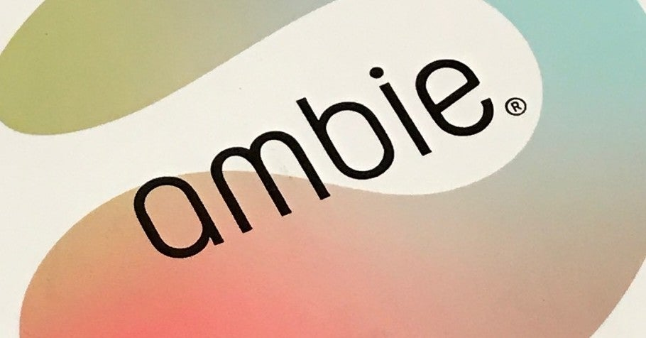

<figure>

</figure>

　3年ほど前に**『ambie』**というイヤホンが発売されて少し話題になった。これは、耳の穴に突っ込むタイプのイヤホンではなく、耳たぶ（のちょっと上）に挟むように装着するイヤホンだ。

[https://www.instagram.com/p/B9SeGhzha\_d/](https://www.instagram.com/p/B9SeGhzha_d/)

　**『ambie』**には、内部のドライバからの音が出力される小さな穴が空いていて、要するに耳のそばに小さなスピーカーを置いてあるような効果で音を聞くことができるという仕組みである。

　さらに、耳の穴を塞がないため、外の音も同時に聞くことができる。そこがウリのイヤホンだ。屋外をランニングするときなど、周囲の音を聞くことができれば、事故や何かのハプニングを予測して防ぐことができるかもしれない。

　僕はこのイヤホンを、ゲーム用に買った。FPSや**『デッドバイデイライト』**など、ゲーム内音声の方向を聞きながら、なおかつチャットなどで話すときに、自分の発している声も自然に聞こえてくるようなイヤホン（またはヘッドホン）が欲しかったからだ。

　早速試してみると、効果は抜群。見事にゲーム内音声をステレオで再生しながら、自分のチャット音声も聞けるという環境ができあがった。ヘッドホンをしてゲームに熱中していると、近くで奥さんに話しかけられても気づかないことがあったが、これならそういうことはまったくない。便利だ。

　耳たぶに挟むという独特の装着方法を採用しているため、慣れないと付けにくいという感想も散見されたが、そんなことは全然なく、写真などでどこに装着するのか前もって把握しておけば、簡単に身につけることができる。もしかすると、耳の厚さによって、付けにくかったり、外れやすかったりすることがあるのかもしれないと思っていたのだが、そんなことはない。イヤホン本体は弾力性のある素材でできているため、ほとんどの場合うまい具合にフィットしてくれるのではないだろうか。

　ただし、耳の中に密着するイヤホンではないので、低音部は響かない。スッカスカのラジオみたいな音声だ。音楽をいい音で聞きたい人には向かないイヤホンだろう。使用目的が極めて明確な商品である。

　ワイヤードモデルと、ブルートゥースモデルがあり、ランニング目的ならブルートゥースが便利なのかもしれないが、今回はゲーム用なので、遅延のないワイヤード一択で購入した。

　**『ambie』**は発売当初話題になっただけあって、少し入手しにくい時期があったが、今はすっかりその熱も冷め、いつでも買える感じになっている。お値段は、ワイヤードが6000円ぐらい。ブルートゥースが13000円ぐらいと、音質からすると若干お高めかなという感じもするが、悪くない買い物だった。これでまたゲームライフがはかどりそうだ。

[https://ambie.co.jp/soundearcuffs/index.html](https://ambie.co.jp/soundearcuffs/index.html)
