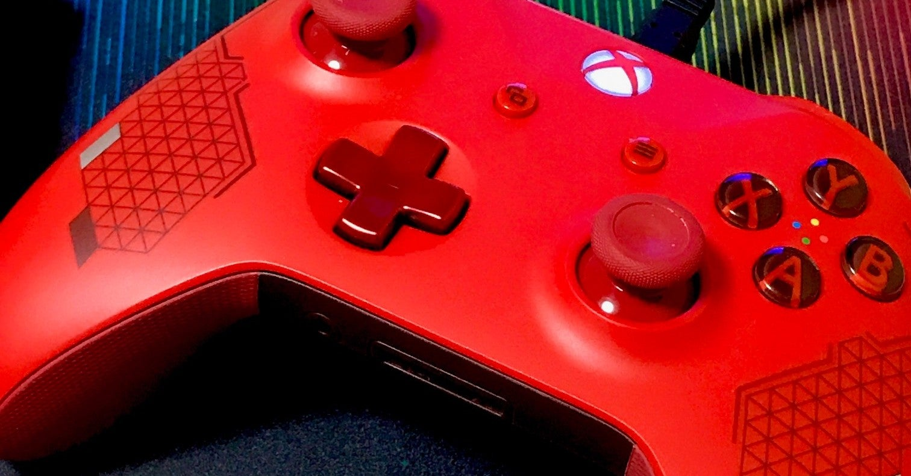

<figure>

</figure>

　2019年の3月に、Xbox One用のコントローラーを買った。スポーツレッドというカラーの特別モデルだ。その名の通り、目にも鮮やかなレッドがまぶしい、いかにもゲーマー御用達といった趣のコントローラーだ。ゲーマーはこういう小物にも凝るものなのだ。

　ところで僕はXbox Oneを持っていない。それなのにコントローラーだけを買ったのは、これをPC専用のコントローラーとして使おうと思ったからだ。PC用のゲームは、割とXboxのボタンは入れを前提としたアサイン、画面上のインフォメーションが使用されることが多く、Xbox用のコントローラーをひとつ持っていると、操作のチュートリアルなどであまり混乱せずに済んで便利なのだ。

　お気に入りのコントローラーを見つけて嬉々としてた僕は、早速PCに接続してゲームをプレイしていた。当時はちょうど**『隻狼』**が発売されたばかりで、毎日のように刀と刀の火花散る弾き合いを楽しんでいた。

　しかし、このチャンチャンバラバラに合わせて、Rボタンを連打していたのが悪かったのだろうか。燃える炎の色をしたコントローラーは、1ヶ月も経たないうちに、Rボタンが壊れてしまった。いや、完全には壊れていないのだが、ときどき反応しないのだ。これは非常に困る。

　**『隻狼』**では、敵の繰り出してくる刀に合わせて、ジャストタイミングでRボタンを押して弾き返すプレイが要求されるのだが、そのRボタンがいきなり効かなくなるのだからたまらない。調子よく刀を弾いていたのが、いきなり棒立ちになり、相手の攻撃を一方的に食らってしまうのだ。ボス戦などで一回攻撃を受けることは致命傷になりかねない。

　結局、ボス戦で重大な事故死を繰り返すことになったコントローラーは、「まったく使えない」という不名誉な烙印を押されることとなった。そりゃ、ボス戦で刀弾いてくれないんだからダメだよな。

　早速僕は、1ヶ月以内に壊れたのなら保証期間だろうと、マイクロソフトに修理に出すことにした。マイクロソフトならすぐに対応してくれるだろうと、サイトにアクセスしてサポートから修理対応のページを閲覧してみる。

　ない。どこにもない。なんと、Xbox本体とか、本体とセットのコントローラーの修理申し込みフォームはあるのだが、コントローラー単体で購入した場合の修理申し込みフォームというのはないのだ。仕方なく、購入したヨドバシカメラにサポートを依頼してみることにした。

　なんと！　ヨドバシカメラではメーカーサポートに直接問い合わせろ。こっちでは一切サポートしないから、という回答。なんという無責任な。売っておいて知りませんとは！　憤慨しながら、もう一度マイクロソフトのサイトに戻るも、対象商品に選択できない限り、シリアルナンバーも入力できず、修理依頼のページに進めないのだからどうしようもない。

　結局、八方塞がりで自前で修理することにした。この時点で、もうだいぶマイクロソフト製品ダメだな、というイメージができあがっていてモチベーションだだ下がりだ。

　と言ったところで、文章長くなったので前編終わり！　続きはまた書こう。おのれマイクロソフト許さんぞ。（というわけで、未だにいくら安売りしようともXbox Oneは買っていない）

　つづく
