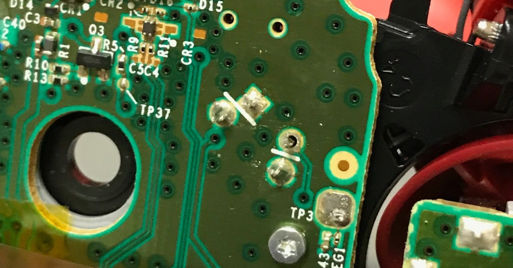
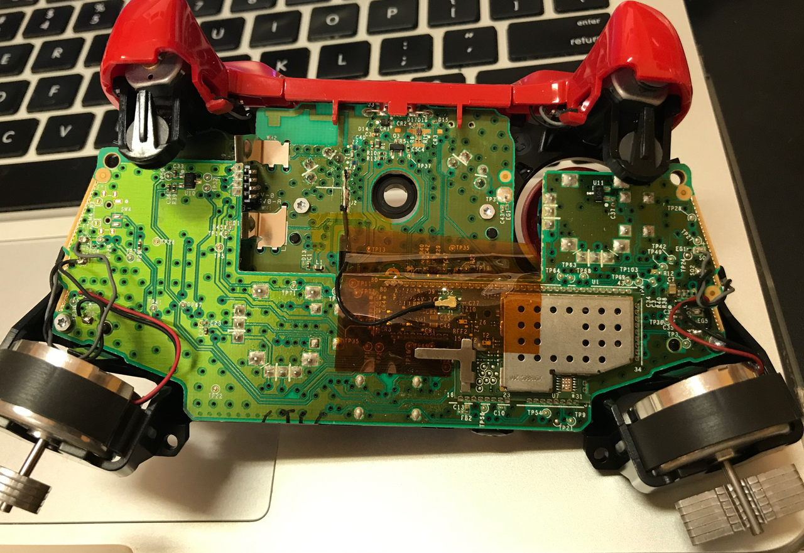
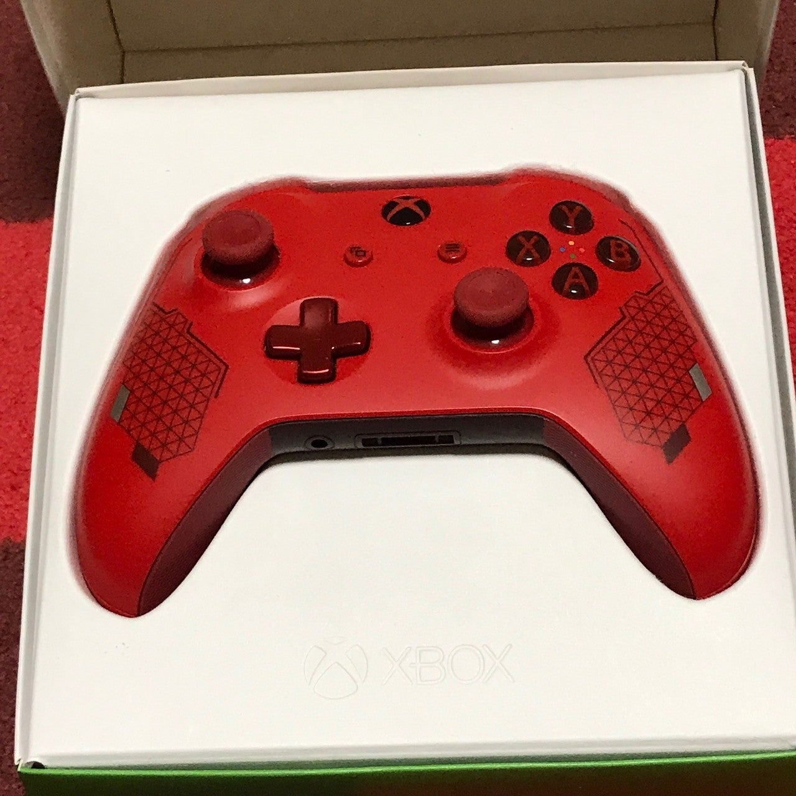

<figure>

</figure>

　壊れたXbox Oneコントローラーは、仕方ないので自分で修理することにした。

（[※この話は、昨日の話題の続きである](https://note.com/keigox68000/n/n79b3533224df)）

　修理と言っても大した修理ではない。Rボタンを押すことでコントローラー内部で押されるタクトスイッチという小さな押しボタン部品を交換するだけだ。

　なんと、Amazonなどを見ると、外側のRボタンそのものから、中のタクトスイッチ、それからスティックなど、様々な部品が売っている。もちろんこれは、マイクロソフト製ではない。おそらく中華製の安い代替部品だ。それに、Xbox Oneコントローラーを開封するために必要な、ちょっと特殊なドライバーなんかも売っている。きっとみんな、マイクロソフトのサポートに見捨てられ、こういう部品を買って自分で交換しようという悲しい人たちが身を寄せ合って生きている、そういう場に違いない。よくわかるよ、その気持ち。

　返す返す、マイクロソフトの塩対応に憤慨しつつ、修理を決意した。

　が、それから早14ヶ月。PCゲーム用には、PS4のデュアルショックを使い、こっちが堅牢なつくりでさっっぱり壊れもしないので、なんだかXbox Oneコントローラーを使う理由も見当たらず、修理はすっかり忘れられ、壊れた新品同様のコントローラーは放置され続けた。あっさり壊れてサポートも受けられないようなコントローラーにはふさわしい処遇だ。いや、実を言うと単に手持ちのハンダ吸い取り線を切らしていて、作業が進まなかっただけなんだけど。

　ハンダ付けはお手の物と言ったところで、修理はものの30分程度で終わった。難しいのは、内部の爪でがっちり固定されていたコントローラーのガワを外すところだった。外すのは簡単だけど、気をつけないと爪が折れる。実を言うと、1ヶ所だけ折れてしまった。悲しい。どうしてなんの罪もない人間がこんな悲しみを背負わなければならないのだ。マイクロソフトよ。

　ようやく元の姿に戻ったコントローラー。Windowsで入力テストも無事に済ませ、いよいよゲーム用コントローラーとして現場復帰することになった。

　いや、いろいろ恨み節を口にしたが、コントローラーの出来自体は素晴らしい。見た目の通り、堂々としたボディにふさわしい手にフィットするホールド感。故障で散々苦しめられた件のLRボタンも、いい位置に配置されていて、ゲーム中に操作するのが一種の快感になるようなデザインだ。何より、マイクロソフト製品だけあって、PCに接続するだけですぐに使えるお手軽さが何にも代えがたい。

　早速**『デッドバイデイライト』**をプレイ。快調なプレイに、これはゲームの成績も良い結果が期待できそうだ。

　と、思いきや、思わぬところでゲームでは致命的なドタバタと音を立てて行動する自分のキャラクター。直ってない！　いや、そうではない。修理する前とは違う不具合が出ているのだ。なんと、今度はRボタンから手を放しても、ほんの一瞬だけ入力が解除されないという不具合が……！

[https://twitter.com/keigox68000/status/1279409526349762560](https://twitter.com/keigox68000/status/1279409526349762560)

　もうこのコントローラーはどうしたものだろうか。ちょっと途方に暮れ、そっと箱にコントローラーを戻したのであった。

