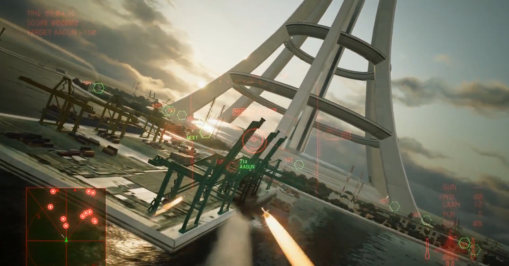

<figure>

</figure>

　VRゴーグル欲しいなあ。と、ずっと思っている。

　別にPC用のVRゴーグルじゃなくてもいいんだ。PSVRでお手軽にVRのゲームを遊べたらそれでいいと思っている。価格もだいぶこなれてきて、今ならすごく買いやすい。それでも買えない理由がある。

　以前、知人の持っているPSVRで遊ばせてもらった。これがもう気持ち悪いのである。普段、車にも峠越えの路線バスにも、遊園地のぐるぐる回る系の絶叫マシンにも酔ったことはないのだが、PSVRを10分プレイしただけで、その後60分は回復しないぐらい酔った。本当に気持ち悪い。

　一番気持ち悪かったのがソニー・コンピュータエンタテインメントの**『ドライブクラブ』**。運転席も含めて大げさなぐらいリアルに揺れる映像が有無を言わさぬ酔いを呼び起こす。車酔いとはこんなにも苦しいものだったのかと、恐るべき仮想現実を叩きつけられた思いだ。

　次に気持ち悪いのがカプコン**『バイオハザード７』**。言うまでもなく大好きなゲームで、何回もプレイした作品であるが、これがVRになるだけで廃墟のような館に本当にいるかのような恐怖を味わえる。しかし、主人公の視点と、自分の普段慣れている視点の高さが違っていて気持ち悪い。いつもよりグルグルと振り回されるような風景に、三半規管ギブアップ待ったなし。実に気持ち悪い。

　意外に気持ち悪くないのが、バンダイナムコの**『エースコンバット７』**だ。これは絶対酔う！　と、自信満々でプレイしたのだが、混迷を極める離陸シーンから、空中大回転の激しいドッグファイトまで、ほとんど酔いを感じずにプレイできた。もっとも、その前にプレイした２作のおかげで、どこか体が不調を訴えていたのは事実だが。

　これは酔わない！　と自信を持って言えるのが、リズムゲームの**『ビートセイバー』**である。リズムに合わせてライトセーバーを振り回し、地平線の彼方から飛んでくる物体を切り刻む、爽快なゲームだ。あまり視点を動かさないためか、酔いはまったくなかった。

　他にも何タイトルかプレイした。ゲームによってだいぶ差があるのだが、ひどい場合は、立ち上がれないぐらいの気持ち悪さを感じてしまうことがわかった。最初にも書いたとおり、普段三半規管由来の酔いを体験することがないため、VR酔いは相当堪えたのである。

　そんなわけで、PSVRで遊んだときの気持ち悪さを考えると、もう体がVRを受け付けない。今から宇宙飛行士の訓練よろしく三半規管を鍛えるという選択肢もあるのかもしれないが、さすがにそこまでの元気はない。しかし、普段は３次元空間に暮らしていて酔うことなどないのだから、いつの日かVR酔いの起きないVRゴーグルが開発されてほしい。その日まで辛抱強く待っているから。
