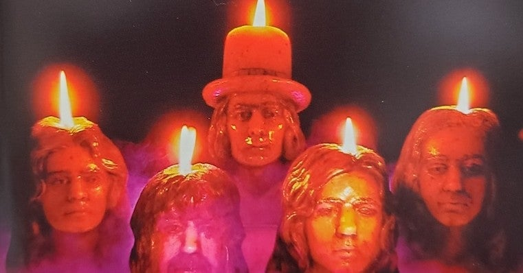

<figure>

</figure>

　人生を変えたアルバム３枚のうちの１枚。ちなみに、あとの２枚は**『ODYSSEY - YNGWIE J. MALMSTEEN\`s RISING FORCE』『DIFFICULT TO CURE - RAINBOW』**で、すでにnoteで紹介済みだ。

[https://note.com/keigox68000/n/n233e01869f10](https://note.com/keigox68000/n/n233e01869f10)

[https://note.com/keigox68000/n/n03a83221fb94](https://note.com/keigox68000/n/n03a83221fb94)

　この３枚のアルバムの何がすごいって、特に文献や（当時インターネットもなかったので）その他の情報に頼ることなく、レンタルCDを手当たりしだいに借りていたら行き当たったというところだ。それぞれに、つながりのあるアルバムっていうのもすごいが、この手のサウンドが好きな人なら、きっと誰でも通る道なのだろう。

　さて、話を**『BURN』**に戻そう。実は、初めて**"Burn"**という曲を聞いたのは、カリフォルニアジャムのライブ映像である。その昔、近所に音楽ビデオを潤沢に貸し出しているレンタルビデオ店があり、今思うと適法だったのかどうか怪しい店だったような気がするのだが、そこで片っ端から借りていたビデオの１本が、**『ディープ・パープル 1974カリフォルニア・ジャム』**だったのだ。入場者25万人とも言われるライブ会場は、地平線まで覆い尽くすほどの観客で、それだけで未体験の迫力映像だった。ライブのオープニングを飾るのがタイトル曲の**"Burn"**で、まだデビューしたての**デヴィッド・カヴァーデイル**の歌声はどこか垢抜けないところがあるもののパワフルだった。アルバム版とは曲の細部が異なるものの、演奏自体はタイトで迫力があった。それだけでなかなかかっこいいバンドだ！　という認識を持つには十分であったが、ギターソロを聞いてぶっ飛んだ。**リッチー・ブラックモア**ならではの、クラシカルなフレーズを聞いて、それまでの音楽に対する価値観、認識がすべて変わったかのようである。この世にこんな音楽があるのか！　これこそ自分の求めていたサウンドじゃないのか。

　って、みんな同じギターソロでやられているんだよね。きっと。とにかく、一気に**ディープ・パープル**というバンドを気に入って、アルバム**『BURN（邦題：紫の炎）』**を買ったのだ。

　スタジオ・アルバムは、さらに演奏が整っていてクォリティの高いアルバムだった。しかし、アルバムを通して聞いてみると、実はブルージーな曲が多く、それがまたかっこいいことがわかる。むしろ、**"Burn"**のようなアップテンポ曲が、このアルバムでは異質なのかもしれない。

　**ジョン・ロード**のハモンドオルガンが下支えとなり、**デヴィッド・カヴァーデイル**と**グレン・ヒューズ**の２枚看板ヴォーカルによる厚みが随所に生きている楽曲は、ときにブルージーで、ときにファンキーなノリ（これは、その後の**ディープ・パープル**の方向性を予感させるのだが）で演奏されている。

　**リッチー・ブラックモア**が**レインボー**時代にも演奏することになるドラマティックなリッチー風ブルーズ**"Mistreated"**、アルバムラストに登場する、なんだかプログレッシブでミステリアスなインスト曲**" "A"200 "**まで、しっかり聞かせてくれるアルバムだ。

　一時期は、メインヴォーカルの**デヴィッド・カヴァーデイル**自身が**"Burn"**をくだらない曲と批判してファンを落胆させたものだが、近年は**ホワイトスネイク**でも**"Burn"**を演奏するなど、晴れてその名曲ぶりが復権されたかのような動きもあって嬉しい限りである。もちろん、メンバーがなんと言おうと、ファンにとっては名曲だ。

[https://www.youtube.com/watch?v=t4fDCwDiWJQ](https://www.youtube.com/watch?v=t4fDCwDiWJQ)
