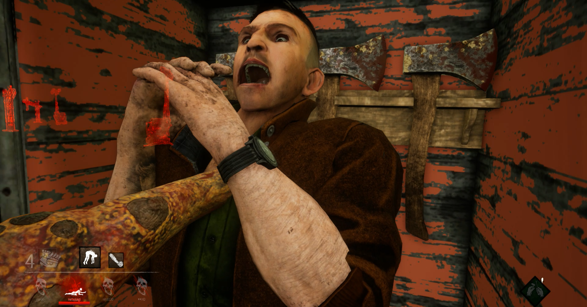

<figure>

</figure>

　以前、**『Dead by Daylightの話』**という記事を書いた。これは、本にでもしようかと思いつつ結局まとまらなくて、note用に修正して掲載した記事だ。今回もそういう文章の1本。**『Dead by Daylight』**というゲームの魅力について、ホラーゲームという視点から自分なりに考えて書いたものである。

[https://note.com/keigox68000/n/n83615d7d1f5e](https://note.com/keigox68000/n/n83615d7d1f5e)

　対人戦のみで構成される隠れんぼ／鬼ごっこの要素を含んだオンラインゲームというだけで十分楽しそうな**『Dead by Daylight』**だが、僕自身はホラー映画を再現したかのような設定と世界観に強く惹かれている。

　このゲームに登場するステージは、そのどれもが邪悪な空気を湛えた、その場に立つだけで恐怖を感じずにはいられない忌むべき場所ばかりだ。リアルなグラフィックによって描かれる廃墟や森、沼などの見るからに呪われた場所。飛び交う不吉なカラスたち。どこからか聞こえるこの世のものとも知れぬ獣の声。打ち捨てられ、主人を失いながらも慟哭する工作機械。それらすべてが、我々プレイヤーに恐怖を与えてくる。

　同時に、ゲームに登場する殺人鬼たちにまつわる陰惨なストーリーは、この惨劇の舞台によりリアルな息吹を与えてくれる。残忍なキラーたちが、どうして無差別な殺戮を行うに至ったのか、その暗い感情を突き動かすものはなんなのか。そういったものが、キラーひとりひとりに設定され、**『Dead by Daylight』**の世界を、より存在感ある恐怖の舞台として完成させている。

　もちろん我々は、こうした恐怖の物語、ヴィジュアルを、すでに世に存在する数多のホラー映画で体験している。映画**『13日の金曜日』**や**『死霊のはらわた』**など、夏のバカンスを楽しむために思慮深くない若者が集まった場所で繰り広げられる惨劇の一夜。まさにそれと同じ雰囲気を、ゲームの中で体験することができるのだ。

　しかも、これは自分がインタラクティブに体験するゲームである。闇の中をさまよい歩き、プレイヤーたちを亡き者にしようとする殺人鬼の影に脅えながら、いつ終わるとも知れない発電機の修理を続けるプレイヤーたち。その恐怖感は単なる映画とはまた一味違う、本当の恐怖を与えてくれるものである。

　このように、「体験するホラー映画」とも言えるプレイ感を提供してくれた**『Dead by Daylight』**。その後の人気上昇に伴い、お手本となったであろうホラー映画とコラボし、その登場人物をゲーム内に登場させるに至ったのである。**『ハロウィン』**のマイケル・マイヤーズ、**『悪魔のいけにえ』**のレザーフェイス、**『エルム街の悪夢』**のフレディ、**『SAW』**のアマンダなど、な我々が映画でよく知る殺人鬼たちが動き回って自分を襲ってくる恐怖（しかも明確に自分を殺戮しようとする意思を持っている！）。それぞれの物語の中で語られる彼らの残虐さを知っている我々にとって、行ってみれば「本物」の殺人鬼が登場したかのようなインパクトだ。

　ホラーゲームにとって、ヴィジュアルやサウンドで怖さを演出することは大事であるが、そこにプレイヤーがプレイすることによって感じる本当の恐怖感を伴って、初めて本当のホラーゲームになると言えるのではないか。そう考えると、**『Dead by Daylight』**は単なる怖い雰囲気を持つホラーゲームから、一気に本当の恐怖を与えるホラーゲームに昇華したと言えるのである。

**※書いた当時、ゴーストフェイス、デモゴルゴン、エクスキューショナーはリリースされていなかったため、文中で言及されていません。**
