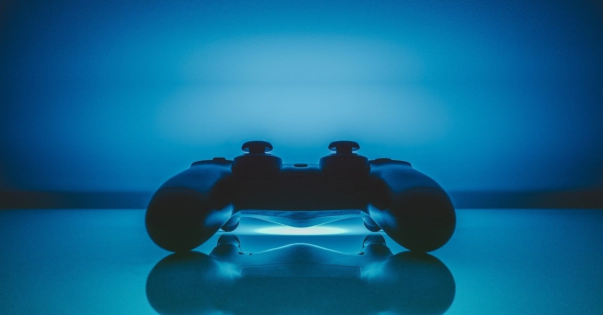

<figure>

</figure>

　先日、Xbox Oneコントローラーが思うように直らなかった話を書いたが、その結果相変わらずPS4のコントローラーをPS4でもPCでも使っている。

[https://note.com/keigox68000/n/n79b3533224df](https://note.com/keigox68000/n/n79b3533224df)

　これは、コントローラーの使い方としておおむね問題ないのだが、ときどきPS4をつけっぱなしにして、PCにコントローラーをUSB接続して使うと、PS4が意図しない動作をしていて焦ることがある。 PS4の電源切れよという話ではあるが、忘れていてときどき起きる。

　今のところ致命的な事態にはなっていないが、知らぬ間に買い物をしてると嫌だなあと思うので、若干コントローラーを分けたい気持ちはある。こういうことは行動が早いのが自分のいいところ、と思っているので早速ネットでPS4のコントローラー、DUALSHOCK4を探した。

　ところが、今純正のコントローラーがないのである。ネットでは品薄の原因がいろいろと噂されているが、その真偽はともかく、売っていないのは事実だ。外出した際に探してみるが、店頭にも売ってない。どうやら本格的に品薄のようなのだ。

　他のコントローラーでもいいのだが、実はPS4のコントローラーが一番安いのである。任天堂スイッチのProコンもXbox Oneのコントローラーも、ちょっと高い。機能を考えると妥当な価格とは思うが、壊れたから、予備に、という理由で気軽に買うのは躊躇してしまう。

　さて、いずれにしても売ってないのは仕方ない。どうやら考え方を変えて、これまで選択肢に入っていなかったサードパーティー製のコントローラーを考えるべきなのかもしれない。品数と価格は申し分ないが、玉石混交の印象は否めず、結果的に高くついたなんてことにならなければよいのだが……
