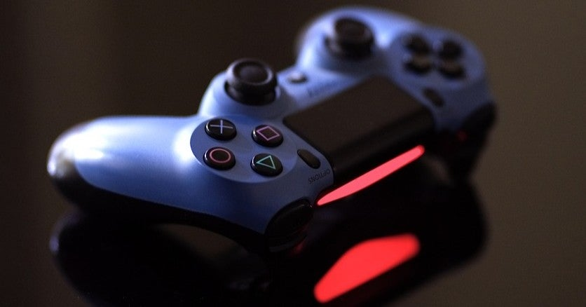

<figure>

</figure>

　PC用に専用のコントローラーを買った。結局何を買ったかと言うと、割と有名な『ホリパッド』である。

※この話は、2日前の記事の続きである。

[https://note.com/keigox68000/n/n9b8d4d250e0a](https://note.com/keigox68000/n/n9b8d4d250e0a)

[https://www.amazon.co.jp/dp/B071W13D4C](https://www.amazon.co.jp/dp/B071W13D4C)

　店頭に行くと、サードパーティのコントローラーはそれなりにあって、特にPS4と任天堂スイッチ対応のものは種類が豊富だ。中には複数のゲーム機とPCに対応する、マルチコントローラーのようなものもあった。一見便利そうだが、今回の「ゲーム機とPCとそれぞのマシンに別のコントローラーを用意する」という目的からはまったく逆の思想なので候補から外した。

　これだけサードパーティのコントローラーが充実しているのは意外な感じだったのだが、逆に言えばそれだけ純正のコントローラーの価格が高い、または供給不足、さらに言えば純正でも意外に故障が多くて買い替え需要がある、そういうことなのではないだろうか。メーカーは純正コントローラーの価格と堅牢性について考えないといけないのかもしれない。

　さて、肝心のホリパッドだが、任天堂純正のプロコンの半額以下とは思えない使いやすさであった。もちろん有線接続で、ジャイロ機能もないということで価格が安いのだが、使用環境によってその手の高度な機能が必要ないとすればこれで十分だし、価格的にも懐に優しい。

　もちろん、これを買ってWindows10のコントローラーとして、もっと言えばSteam等のゲームのコントローラーとして使えるのかという不安もあったのだが、結論から言えば接続しただけで勝手にドライバをインストールして使えるようになった。

　Steamの基本的な設定には任天堂スイッチのコントローラー用の設定があり、ほとんどのゲームがそのまま対応してくれる。任天堂のコントローラーは、マイクロソフトのコントローラーとABボタンが逆なのだが、それも設定で入れ替えてくれるので、画面の表示とボタンが違っているということもない。（もっともこれについては、使い慣れているボタンが入れ替わるので、注意が必要だが）至れり尽くせりの設定が用意されているわけだ。

　ボタンの押し心地は、ちょっと固めで、慣れたコントローラーとは違う感触に違和感を覚えたが、これはしばらく使っていたらすぐに慣れた。もしかすると自分の順応性が高いのかもしれないし、普段使っているコントローラーへのこだわりなんて、そんな程度のものかもしれない。あとは、故障がなく長く使えれば言うことはない。

　ちなみにこのホリパッド、なぜか十字ボタンの「十字」の部分がカバー式になっていて取り外しができる。カバーの下には、上下左右４方向に独立したボタンがついていて、その状態でも使用できる。十字ボタンが押しにくいというのはままあることだが、これならあまり押しにくさに悩まされることもない。ちなみに、取り外したカバーは、ホリパッドの裏面に装着しておくことができる。部品がなくならない配慮は、僕みたいに細かい部品の保管が苦手な人間にはありがたい配慮だ。こういうの、ユニバーサルデザインだよね。

　というわけで、あまり悩まずに価格だけ見て買ったホリパッドだが、思った以上に満足度が高かった。いや、単に自分がそれほどこだわりなくコントローラー使えるってことだったのかもしれないのだが。しかし、考えてみれば、今後も新しいゲーム機が登場するであろう中、大事なのはこだわりのコントローラーを探すことではなく、どんなコントローラーが来ても対応できる順応力なのかもしれない。
