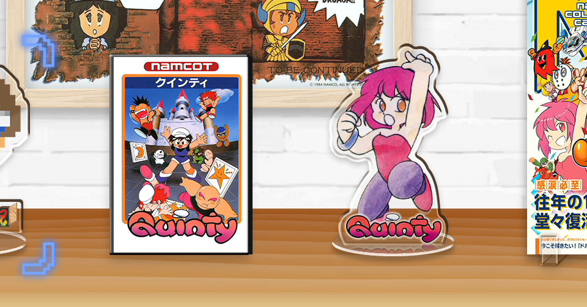

<figure>

</figure>

　**『クインティ』**というファミコンゲームがある。先日発売された**『ナムコットコレクション』**にも収録されているアクションゲームだ。もっとも、ゲームデザイナーの田尻智率いるゲームフリークの作品と言うことで言うまでもなく有名なゲームかもしれない。

　ファミコンを持っていた当時も、**『クインティ』**は勝って遊んでいたのだが、ここ数日**『ナムコットコレクション』**でもプレイしていて、いろいろ当時のプレイ感というか、遊んだ記憶がよみがえってきた。

　**『クインティ』**は、床板をめくって敵を飛ばして倒すというのが、アクションゲームとして新しい要素だった。それが売りだったのだが、敵の動きがどれもいやらしく、意地の悪い動きをしてくる。プレイヤーを有利にするアイテムは、そのどれもが床に隠されていて、とにかく床をめくらないと出現しない。すべてのアイテムが隠しキャラと言ってもいい。もたもたとプレイしていると、あっという間に時間切れになって、敵キャラが猛スピードで襲いかかってくる。こうなると、もう床をめくっている場合ではない。逃げるだけで精一杯だ。

　それでも遊びまくって、各ステージのアイテムの場所を覚えれば、効率よくパワーアップを取得して、素早く敵キャラを倒し、時間切れになる前にステージをクリアできる。プレイヤーを1UPさせる星アイテムも、場所を知ってたくさん取れば、プレイヤーが増えるだけでなく、足の速さもアップして敵からも逃げやすくなる。とにかく、覚えながら進まなければならないゲームなのだ。しかし、ファミコンを持っていた当時は、こんな難しいゲームだった**『クインティ』**だが、何回も繰り返しプレイして、なんとかクリアした。

　久々に**『クインティ』**をプレイして、そんな当時の感覚がすべてよみがえってきた。いつの間にか名作として名をあげていた**『クインティ』**。みんな、その実態がこんなに難易度の高いゲームだと知っているのだろうか。みんな、このゲームをクリアしたのだろうか。

　確かに完成度の高いゲームである**『クインティ』**だが、その難易度の高さを考えると、僕はあまり素直に人にこのゲームを勧められない。決して悪く言うつもりではないのだが、みんな当時このゲームを楽しく遊んでいたのか疑問に思ってしまうのは事実だ。

　さらに言えば、**『クインティ』**にはご丁寧に、裏面とも言うべきEXTRAなるゲームモードも用意されている。そこまできっちり遊んだ人はいったいどれだけいるのだろう。本当に難しい。

　しかし、今回**『ナムコットコレクション』**に収録された**『クインティ』**は、当然途中セーブや、巻き戻し機能が使える。もしかしたら、これなら少しは楽しく遊べるのかもしれない。そんなことを思いながら、ちょっとずつ、ちょっとずつセーブをしながら、今また**『クインティ』**をクリアに向けて進めている。もしかしたら、昔とは少し違う感想が持てるのかもしれない。それでも苦しいゲームだ……
