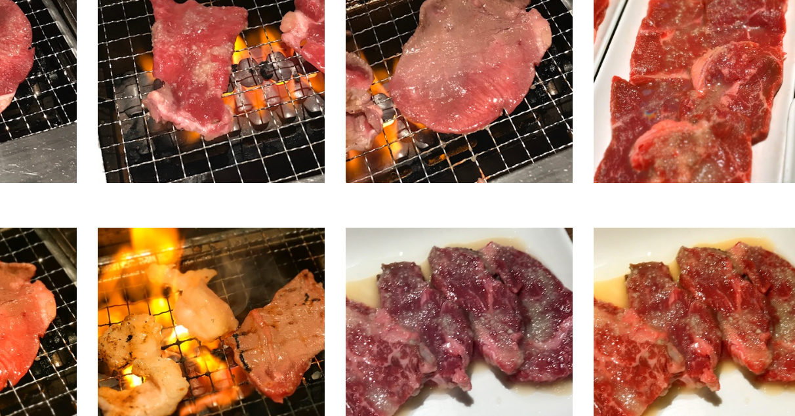

<figure>

</figure>

　相変わらずスマホで撮った写真を消している。正確に言えば、クラウドにバックアップされた写真を消している。

　写真を消していると、自分が何の写真を多く撮っているのか、その傾向が見えてくる。

　一番多かったのは、なんと言っても食べ物の写真だ。それも、肉が多い。焼き肉とか、和牛のいい肉とか、そういうのをねらって写真を撮っている。人生において、肉を食べる瞬間がそんなに嬉しいのか。自分で自覚していなかったが、どうやら肉が出てくると喜々として写真を撮っているようだ。

　次に多いのは本の写真。それも自分の部屋に積まれた本の様子を撮影しているのだ。これは一体何を撮っているのか。そう、本を買うときに、以前飼ってあるのを忘れて同じ本を買わないための記録としての写真である。これは正直情けないし、無駄な写真だと思う。そもそも、本屋で本を買うときに、この莫大な量の写真から、お目当ての一冊を持っているのか持っていないのか、どうやって探し出そうというのだ。まったくもって意味不明である。

　あとは行った場所の風景が多いようだが、中にはPCのモニターに映っているパスワードとか、仕事の書類とか、あまり写真にするには好ましくないもののある。速攻で消した。書類なんか、写真で撮らずに、せめてスキャンしておいてほしいものだ。

　そうやって、大量の写真を消していて気づいた。いくら消しても、使用中の容量が減っていかない。写真を削除したのに、全然削除されていないのだ。すぐに理由がわかった。このクラウドは、削除した写真を40日間ゴミ箱の中で保存してくれるのだ。だから、いくら写真を削除しようとも、それが実際に容量に反映されるのは40日後ということだ。そうか、これが原因でクラウドがすぐにあふれるのだな。（どう考えてもそれだけが原因ではないが）

　これはもうすぐにゴミ箱の中も消すしかない、と片っ端から削除した。和牛も本も、ゲームのパスワードも書類もすべて電子の塵と化した。これで今度はクラウドの容量不足に悩まされることはない。まさか、懸命に消していた写真がそのままそっくり残っているとは予想外であった。

　もしかしてこれは、わざと完全削除までの猶予時間を設けて、その間にあふれたクラウド容量を増量させる作戦ではないのだろうか。そんなうがった見方をしてしまうぐらい、クラウドを圧迫していたいらない写真。せめて、削除した写真を即座に消すオプションぐらいは設けてほしいものだ。しかし、今回の出来事でひとつ賢くなったような気がする。
