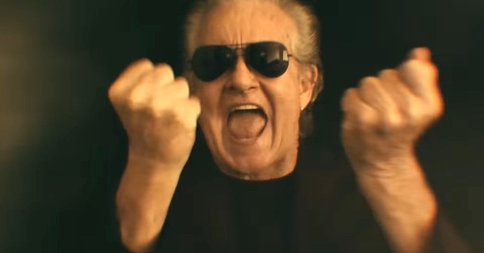

<figure>

</figure>

　**グラハム・ボネット**は主にヘヴィメタル、ハードロックを歌い続けてきたヴォーカリストだ。72歳の現在も精力的に活動し、この7月18日には40年ぐらい前に活動していたバンド、**アルカトラス**の名義でニューアルバムをリリースする。本当にすごい。（この話はいろいろ衝撃的すぎて、以前もnoteに記事を書いている）

[https://note.com/keigox68000/n/n32e910943321](https://note.com/keigox68000/n/n32e910943321)

　しかし、普通に考えたら70歳はヘヴィメタルを歌わない。特に**グラハム・ボネット**の場合、若い頃から額に青筋立てて歌うパワフルな歌唱スタイルがそのままで、僕も数年前に本物を見たが、ステージの上でいつ倒れのではないかと気が気ではないぐらい力が入った歌声である。

　ヘヴィメタルは古い音楽ジャンルで、もうその全盛期をとうに過ぎている。当然、それをプレイする人たちも年を取ってくる。若い世代にもヘヴィメタルを愛する人たちがいて、その遺志を受け継いでいるようなバンドもいるが、おおむね高齢化の音楽ジャンルだ。

　**グラハム・ボネット**率いる**アルカトラ**スもその例に漏れず、一番若いのがドラムの**マーク・ベンケチェア**で56歳だ。PVなんか、もう老人養護施設の発表会みたいになっている。

　しかし、それでも、一定のヘヴィなサウンドが生まれ出てくるのは驚きだ。さすがに**グラハム・ボネット**の声は衰えているし、もともと**イングヴェイ**大好きおじさんだった**ジョー・スタンプ**のギタープレイは垢抜けなくて、鋭さもない。でも、確実にヘヴィメタルなのである。

　平均年齢63歳のバンドでも、その音は相変わらず鋼鉄の精神にあふれている。一体これはなんなんだ。どうして70歳超えがこんなに力強い声でシャウトできるのだ。三つ子の魂百までとはよく言ったもので、結局彼らにはこのスタイルしかないのかもしれない。墓場までメタル魂を持って行くしかないのだろう。

[https://www.youtube.com/watch?v=YTBjUHR2E\_o](https://www.youtube.com/watch?v=YTBjUHR2E_o)

　ふと、自分はどうなのかと考える。今、毎日ゲームをやり込んで暮らしている自分。70歳を超えたらゲームをやっていないのか。

　いや、それは考えにくい。結局、人間誰でも若いときに獲得した何かを、死ぬまで抱えて持って行くしかないのだ。それは、不滅の精神を体現していることだし、見事死ぬまで好きなものを貫き通せば、それはそれで美しく力強い人生と言うことなのかもしれない。

　件の**アルカトラス**のニューアルバムリリースを目前にそんなことを考えていた。明後日が楽しみだ。
