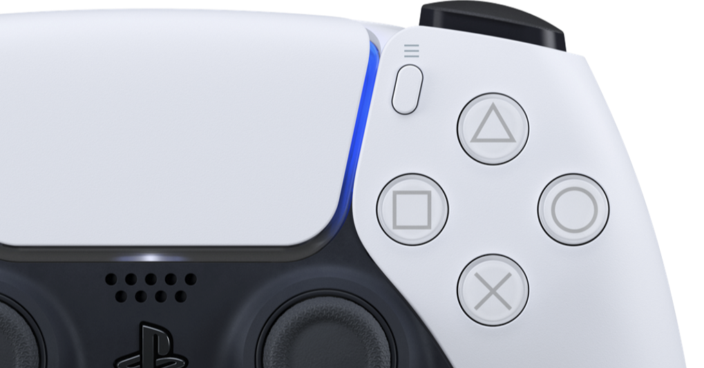

<figure>

</figure>

　深夜にPS5のコントローラー**『Dual Sense』**のレポート動画が流れていた。新しいコントローラーは、なぜか甲殻類を思わせるような流線型の美しいデザインと、トリガーの抵抗力が変化するアダプティブトリガー、触覚に訴えかけるハプティックフィードバックが売りのようだ。わかったようなわからないような。

　この**『Dual Sense』**コントローラー単体での価格などは発表されていないが、いつもコントローラーの摩耗と故障に悩まされた身としては、真っ先に値段が気になってしまう。さもしいと言うなかれ、ヘヴィにゲームをやる層にとって、コントローラーの買い換えは死活問題なのだ。逆に言えば、それだけ壊れるってことでもある。

　かつて任天堂のゲームキューブが登場したとき、そのコントローラーのユニークな形状に驚いた。基本はそれまでのコントローラーを踏襲しながら、グリップや数多くのボタンを押しやすく配置したデザインは非常に印象的で、未だに任天堂スイッチ用のゲームキューブコントローラーなどという、矛盾した名称のコントローラーが売られているぐらいだ。その後も任天堂は、新しいゲーム機を出すたびにこだわりのコントローラーを提案してきた。一方でソニーは、初代プレイステーションのコントローラーを踏襲するような形で、基本に忠実なコントローラーを進化させてきたように見える。

　しかし実態は、任天堂もソニーも、そのコントローラーには振動を演出するモーターを内蔵し、操作においてはボタンのみならず、加速度センサーなどを併用して入力できるようなデバイスに進化してきたことで共通している。要は、似たようなテクノロジーを用いながら、あとはインターフェースとしての演出を各社工夫してきたということなのかもしれない。

　さて、今回の**『Dual sense』**も、実際に使ってみれば新鮮な驚きがあることだろう。その機能をフルに生かしたゲームも登場するに違いない。それは素直に楽しみである。

　だが同時に、ゲームプレイによって酷使されるコントローラーである。きっと故障する日が来ることだろう。それも集中的にゲームを遊ぶ、PS5発売から間もない時期に故障が現れそうだ。そのときに、我々に安価に、しかも入手しやすく新しいコントローラーを手にする方法はあるのだろうか。

　実を言えば、ゲームをプレイするとき、毎回振動が必要とは思わない。加速度センサーで操作するゲームはそれほど多くない。そう考えると、ゲーム機メーカーは、そろそろ高級コントローラーと、普及版コントローラーの2種類を用意すべきだろう。普段ヘヴィに遊ぶゲームには、壊れても買い換えが容易な安価なコントローラーを使いたい。

[https://www.youtube.com/watch?v=SebzB8W3bVU](https://www.youtube.com/watch?v=SebzB8W3bVU)
