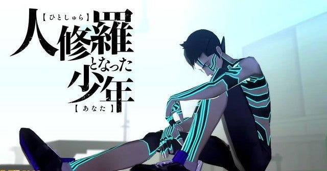

<figure>

</figure>

　**『真・女神転生IIIノクターン HDリマスター』**が任天堂スイッチ用にリリースされる。さっきニンテンドーダイレクトでその情報が流れていた。（PS4用もあるらしいよ）

　**『真・女神転生IIIノクターン』**は、どちらかと言うと硬派なRPGで、現在の**『ペルソナ**』シリーズのような、明るくて青春の息吹あふれるテイストは皆無だ。主人公の友人は登場するが、**『ペルソナ』**シリーズのように親交を深めることはない。詳しくはプレイしてほしい。

　そして何より、広大なマップと、複雑なダンジョンがプレイヤーの行く手を阻む。敵の強さもあいまって、地獄の苦しみという表現がしっくりくるガチのRPGだ。

　**『真・女神転生IIIノクターン』**は、後に**『真・女神転生IIIノクターン マニアクス』**というバージョンが発売される。これは、**『デビルメイクライ』**のダンテがゲストキャラクターとして登場する、スペシャルバージョンだ。何しろ他社のキャラクターをわざわざ登場させるのだから、これでもかというぐらいかっこよく作られている。ダンテの造形そのものから、登場シーン、BGMに至るまで、ゲストキャラクターの扱いとしては完璧だ。

　その後、**『デビルサマナー 葛葉ライドウ 対 アバドン王』**に付属する形で**『真・女神転生IIIノクターン クロニクルエディション』**というのも発売される。こちらは、ダンテをアトラスの自社キャラクター葛葉ライドウに置き換えたバージョンだ。どうやらダンテが使用できない代替え品らしい。これも決して悪くないのだが、ダンテのインパクトには及んでいないと思う。

　今回発売される**『真・女神転生IIIノクターン HDリマスター』**は、ダンテではなくライドウが登場するようだ。さすがに今ダンテを登場させることはできなかったか。非常に残念ではあるが、あの厄介者のRPG**『真・女神転生IIIノクターン』**がリメイクされることは本当に本当に嬉しい。ゲームのシステムやストーリーの、素人お断りのような面白さもさることながら、**目黒将司**による崩壊した世界に跋扈する悪魔を音楽で表現したかのようなBGMが素晴らしい。

　発売は10月29日。今から楽しみだ。多くの人に、あの伝説の悪魔的ロールプレイングゲームを体験してほしい。

[https://www.youtube.com/watch?v=CT8Voxr2Vx0](https://www.youtube.com/watch?v=CT8Voxr2Vx0)
