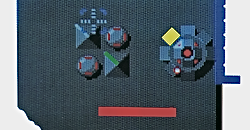

<figure>

</figure>

　ゲームのサントラを結構たくさん持っている。その昔、細野晴臣プロデュースの**『ビデオ・ゲーム・ミュージック』**のレコードを発売日に買って以降、長年にわたってゲームミュージックのレコードとCDを買い続けた結果だ。

　しかし、その後ゲームのサントラを聴き直すかと言えば、実はあまり聴いていない。特にチップチューン時代のチープなサウンドは、その音に独特の魅力こそ感じるものの、普段聴く音楽としてはあまり選択されない。もちろん嫌いというわけではない。好きなのだが、あまり聴かないのだ。

　もちろん、日常にPSGやFM音源の音が鳴り響く生活もありかもしれない。しかし、個人的にはなかなかそういう音楽生活にはならない。音楽を聴くのは好きで、毎日何らかの音楽を聴くのだが、その中に電子音はあまり入ってこない。

　今もCDラックにはたくさんのゲームミュージックのサントラが並んでいる。もちろん大切なCDだ。ゲームにとってBGMがすごく大事な位置を占めていることも理解している。とは言え、日常の生活に溶け込む音楽にならないとなると、その立ち位置は非常に微妙というか、自分でもどう理解していいのか悩む部分ではある。

　今や、ゲームミュージックはハードの制限から解放され、限りなく自由な表現を手に入れた。そのジャンルも多種多様となり、音楽的な方向性から言えば、無限に拡散しつつある。そうなってくれば、ゲーム音楽というくくりで特に選択して聴くこともなく、逆に、音楽的に気に入れば日々聴くのかもしれない。そういう捉えになりつつあるゲームミュージック。さて、かつて買い集めた思い出の詰まったゲームサントラは今後自分の生活の中でどんな立ち位置になっていくのか。ちょっと気になりつつ、大事に付き合っていこう。

[https://www.youtube.com/watch?v=v\_iU9G2lokU&t=860s](https://www.youtube.com/watch?v=v_iU9G2lokU&t=860s)
