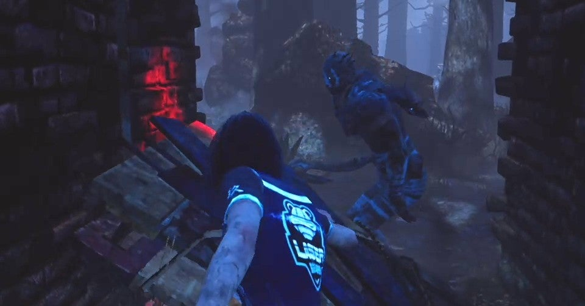

<figure>

</figure>

　相変わらず**『デッドバイデイライト』**が面白い。今日は、昼間から5時間もぶっ通しで遊んでしまい、自分の大人としての資質にも疑問を持ってしまう勢いだ。

　その**『デッドバイデイライト』**だが、実は人に勧めたことがない。「おもしろいから遊んでみてよ」みたいな感じで、人に紹介していないのだ。もちろん、聞かれれば「おもしろいよ。やってみよう」とは言う。しかし、自分からはなんとなく勧めにくいようなイメージがあって、勧めていないのだ。

　では、**『デッドバイデイライト』**のどこが人に勧めにくいのか。ひとつは、**『デッドバイデイライト』**がホラーゲームということにある。

　単純に、怖いのが苦手という人も多い。**『デッドバイデイライト』**の場合、そこに加えて、結構残酷な描写は多い。慣れてしまうと、むしろコミカルにさえ見える演出だが、例えば人間を先の鋭いフックに吊すとか、そもそも巨大な鈍器や刃物で逃げる生存者に殴りかかる行為自体、かなり残酷な話だ。あまりに残酷なゲームに、思わず引いてしまう人もいるだろう。常識的に考えて、人には勧めにくいわけだ。

　次に、ときとして、ゲーム中のプレイヤーの遊ぶ態度があまりよろしくないことがある。1対4に分かれてプレイする**『デッドバイデイライト』**では、どうしても、4人を相手にする殺人鬼が、ひとりいじめのような構図になりやすいゲームだ。特に、「あおり」と言って、生存者が殺人鬼に対してあざ笑うようなジェスチャーを取る行為が嫌われる傾向にある。気にしなければそれまでなのだが、これはずっと言われ続けていて、やっぱり人間感情があるので看過できない部分なのだ。また、プレイ中に思うようにゲームが進まない場合に、ネットワークを切断して投げ出してしまうプレイヤーがいることも、人に勧めづらい理由のひとつだ。そういうプレイする人の態度に、ストレスをためる人もいる。万人には勧めづらい理由だ。

　最後に、ゲームをプレイする環境が、もしかしたら敷居が高いかもしれない、ということがある。**『デッドバイデイライト』**は、日々アップデートでその内容が変化している。任天堂スイッチで遊ぶのが、現状では一番プレイしやすい環境かもしれないが、実は任天堂スイッチ用の**『デッドバイデイライト』**は、本体のスペックの低さから、ゲームにならないぐらい遊びにくい。結果として、プレイステーション4で遊ぶことを勧めたいのだが、プレイステーション4版は、できればプレイステーション4Proで遊ぶのが望ましい。さらに、PS4Proで遊んだとしても、PC版と比べると若干ロード時間が長く、マッチングにも時間がかかるため、やっぱり遊びにくい。そうすると、結局はPC版を勧めるのだが、普段から3Dのゲームで遊んでいる人ならいざ知らず、そうでない人にゲーミングパソコンの購入から始めさせるのは非常に敷居が高い。そういうゲーム環境面への投資の大変さが勧めづらい理由だ。

　いろいろ理由があって、簡単には勧めにくいゲーム**『デッドバイデイライト』**だが、本当はすごく面白い。すごく面白くて、僕はあなたと一緒にこのゲームをプレイしたいのだ。本当は声を大にしてそう言いたい。でも、良識的な大人であればあるほど、簡単に勧めづらい。それが**『デッドバイデイライト』**というゲームの最高に困った点でもある。

　でも、ここには書いてしまおう。パソコン買って、一緒に**『デッドバイデイライト』**をやろう。すごく面白いよ！

[https://www.youtube.com/watch?v=b-iEpukovNc](https://www.youtube.com/watch?v=b-iEpukovNc)
