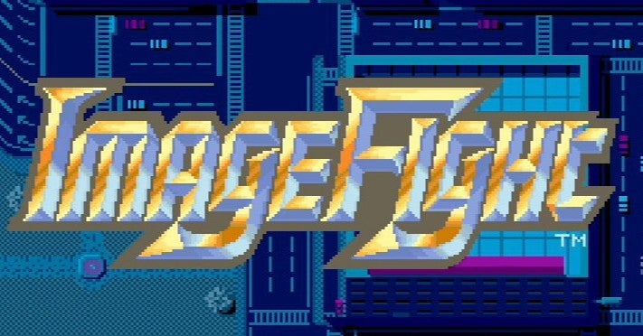

<figure>

</figure>

　**『イメージファイト』**は、1988年にアイレムがリリースしたアーケード用縦スクロールシューティングゲームだ。数年前にPS4のアーケードアーカイブスに移植されたので、今さらながら練習している。

　なんとなく**『イメージファイト』**はガチガチのパターンを組んで、そこから外れないように攻略する高難易度のシューティングゲームと思われている節があるが、実はそうでもない。

　もちろん敵の出現パターンを覚え、アイテムの出現位置を覚え、それを使いながら攻略することには違いがない。特にアイテムの出現にはランダム性はなく、決まった場所で決まった武器が手に入る。その、ランダム性を廃したゲームデザインが、ガチガチのパターンゲームと思われる所以かもしれない。

　しかし、**『イメージファイト』**をプレイしていると、ゲームの進行はランダムでなくとも、プレイする人間の方が思わぬミスをすることが多々ある。いや、むしろそんなに正確に同じパターンを追ってプレイできる人間は多くないし、たかがゲームで遊ぶのに、それではあまりに息苦しい。

　実は**『イメージファイト』**は、敵と武器の出現位置を覚えると、その組み合わせでその人なりの、あるいはそのプレイのときにひらめいた思いつきでピンチの局面を乗り越えられることが多いゲームなのだ。ガチガチのパターンを組むより、その多様性ある攻略が楽しいゲームだ。

　そうやって**『イメージファイト』**というゲームを捉えると、今まで、どうしてこんなに使えない武器があるのだろう。とか、なんでここにいらない武器を配置してあるのだろう。などと考えていたゲームのデザインがまったく異なった意味合いで見えてくる。

　ステージ7の終盤に突如現れるサーチミサイルというちょっと弱い武器。弱いけど敵を追尾してくれる。しかし、それを取れば間もなくボスだ。ここでサーチミサイルを取る意味はない。今までそう思っていた。しかし、ある日、武器が何もない状態でそこへ到達したときに、試しにサーチミサイルを取ってみた。ボスは少し苦労した。しかし、続く最終面ステージ8で、大量に出現する敵の放題をサーチミサイルが一掃してくれるのだ。

　なるほど。別の攻略法を考えると、さらにデザインの奥深さに触れることができる。これはわかりやすい一例だが、そうやってプレイしていると、思わぬミスをしたときに、思わぬ攻略法を編み出すことで、状況が打開できることがわかる。このゲームのデザイナーが、このような仕掛けをすべて意図して組み込んだのかはわからない。しかし、**『イメージファイト』**において、その敵と武器の出現は実に多種多様な攻略法を生み出し、我々プレイヤーに攻略することの楽しさを提供してくれる。これこそが、**『イメージファイト』**最大の魅力である。

　もしかしたら、シューティング上級者は、ガチガチのパターンで一切ミスをせず、効率いいクリアをしていくのかもしれない。しかし、ミスをしたときに行き詰まることなく、それならこれでどうだ！　とばかりに、新しい戦術を考えることができる。それが**『イメージファイト』**の楽しみ方だろう。

　もう30年前のゲームである。今さらという感じではあるが、興味を持ったら挑戦してほしい。連射やボタンのアサインもできて、昔のテーブル筐体と比べると、飛躍的に遊びやすい機能も搭載されている。こんなストイックなゲームにしばし没頭するのもいいものではないか。

[https://www.youtube.com/watch?v=dKAuxFely7g](https://www.youtube.com/watch?v=dKAuxFely7g)

**追記**：この記事の公開後、アイレムでゲームを開発されていた方から、ツイッターでリプライをいただきました。

[https://twitter.com/mitsumame1212/status/1287392306920751104](https://twitter.com/mitsumame1212/status/1287392306920751104)
