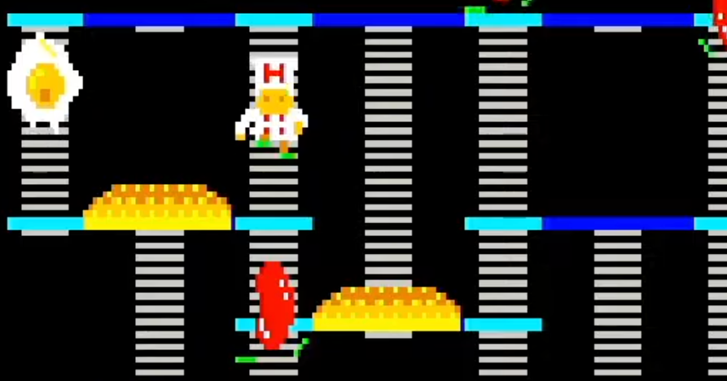

<figure>

</figure>

　今週アーケードアーカイブスにラインナップされた『バーガータイム』は、1982年にデータイーストがアーケード用としてリリースしていたアクションゲームである。

　当時、このゲームは『ハンバーガー』というタイトルだったように思うが、どうやらタイトルの権利関係で『バーガータイム』に変更になったようだ。

　なお、アーケードにも『ハンバーガー』と『バーガータイム』の両方が存在し、国内版、海外版等の違いでタイトルが異なるようだ。

[https://twitter.com/crazyrallyX/status/1289101193315155968](https://twitter.com/crazyrallyX/status/1289101193315155968)

　ゲームは、迷路のような通路にはしごのかけられたステージに、巨大なハンバーガーの具材、レタスやハンバーグ、バンズがなどが置かれており、コックであるプレイヤーは画面内を歩き回りながらそれらの具材を踏みつけ、画面の下方に落としてハンバーガーを完成させるというものだ。正直、子供心に衛生的にどうなの？　という素朴な疑問が浮かんでしまうゲームデザインだ。でもまあ、当時のゲームにはありがちなシュールだけどゲームとしてうまくまとめたゲームデザインであるとも言える。

　僕はこのゲームがいまひとつ上達できなかったのだが、その原因が、敵の動きに無駄がなさ過ぎるところである。あまり足が速くなく、よちよち歩きのようにようやくステージ内を歩き回るプレイヤーキャラクターに対し、無駄のない動きでプレイヤーを追ってくる敵たち。ちなみに敵キャラクターは、目玉焼きやソーセージである。そいつらの、あまりに容赦ない追跡にいつかプレイヤーは追いつかれ、やられてしまうのだ。

　一応敵を避けるために、足止め用のコショウが武器として用意されている。しかし、それも数に限りがあり、ほとんどの場合はゲームの序盤で無駄に使われて消えていく。しかも、ゲームを開始してすぐ1面から、敵の動きには無駄がない。

　そんな、ちょっと苦手意識のある『ハンバーガー』こと『バーガータイム』が今回アーケードアーカイブスで復活したと聞いて、早速プレイしてみた。あの当時難しかったゲームは、果たして今遊ぶとどんな感触なのか。

　結果は、相変わらずの難しさだった。執拗に追ってくる敵を避ける手もあるはずがなく、僕の操るコックは次々と巨大な食材の餌食となっていった。今も昔も難しい。それが変わらぬ『バーガータイム』の感想だ。

[https://www.youtube.com/watch?v=frjHWix1NGE](https://www.youtube.com/watch?v=frjHWix1NGE)
