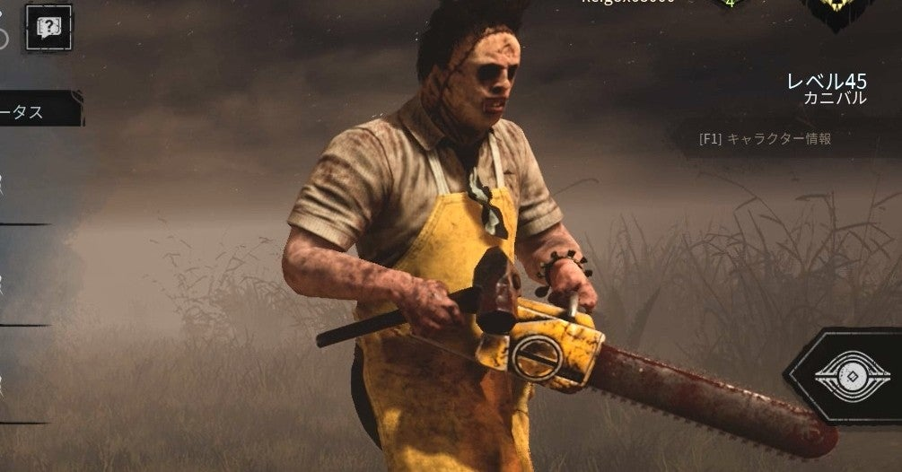

<figure>

</figure>

　いきなり何の話か。カニバルはゲーム**『デッドバイデイライト』**に登場する殺人鬼の名前だ。ゲームではカニバルと呼ばれているが、実は映画**『悪魔のいけにえ』**に登場するレザーフェイスのことだ。

　実は先ごろ、このレザーフェイスことカニバルに調整が入って強化された。これまでも、チェーンソーを振り上げて生存者達に襲いかかる姿はあまりに恐ろしすぎ、こんなキャラクターをゲームに登場させていいのかと思わずにはいられなかった。

　それが強化されたのだから、こんな恐ろしいことはない。具体的には、チェーンソーのパワーをためることで、チェーンソーを振り上げて襲いかかる攻撃が3段階に延長できるようになった。いつまでもいつまでも生存者を追ってくる、新カニバルの登場だ。

　このしつこさを演出したかのようなキャラクター強化は、映画**『悪魔のいけにえ』**で、主人公サリーをどこまでも執拗に追い続けるレザーフェイスの恐ろしさをそのままゲームの中に持ち込んだようである。とにかく恐ろしい。ゲームに負けるとか、そんなことよりも人間の心の中にトラウマを植え付けかねない、根源的な恐怖だ。

　映画『悪魔のいけにえ』は公開当時、そのリアルな映像描写故、とにかく残虐さばかりがクローズアップされたようだ。しかし、改めてこの作品を見てみると、**『イージーライダー』**のようなロードムービーに、正体不明の殺人鬼一家が登場してくるだけのシンプルな作りだ。荒涼としたアメリカの片田舎や、殺人鬼一家に異常な屋敷が、低予算ながらリアルさを感じさせる小道具で端的に描かれる。これはもう芸術的とさえ言える映像美で、フィクションの中に真実を描く映画というメディアのなんたるかを雄弁に語っているようだ。

　そんなアーティスティックな映画**『悪魔のいけにえ』**の殺人鬼を、ゲームでどうやって表現するのか。**『デッドバイデイライト』**の製作スタッフが選択した方法論は単純であった。とにかく、ひたすら生存者を追いかけるだけの恐怖の殺人鬼を作り上げた。カニバルの能力は、一人の生存者をフックに吊ったら、次の犠牲者を見つけるために、逃げる生存者の影が見える「バーベキュー＆チリ」というパークだ。この名前がまたいいじゃないか。

　そうやって、次々と獲物を見つけては追いかけるだけの殺人鬼。それがカニバルだ。これはもう映画に匹敵する恐怖を、ゲームで実現したと言っても過言ではない。

　そして今、そのカニバルがさらに生存者を追いかけることに執心しているかのような能力を手に入れた。一体、**『デッドバイデイライト』**の製作スタッフはどこまでプレイヤーを恐怖に陥れれば気が済むのか。

　気がつけば、今日も**『デッドバイデイライト』**の世界にはチェーンソーの音が響き渡る。恐怖の夜が始まる……

[https://www.youtube.com/watch?v=-keGmNZ2pLw](https://www.youtube.com/watch?v=-keGmNZ2pLw)
