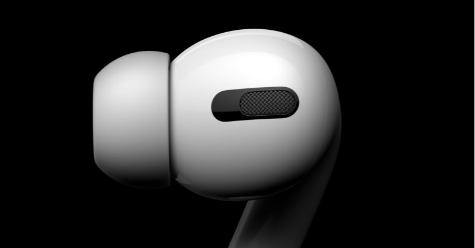

<figure>

</figure>

　もう何年も愛用しているiPhone7 Plusで音楽を聴くときに使っていたヘッドホン（イヤホン）がなくなってしまった。

　iPhone7にはヘッドホン端子がないため、普通のヘッドホンを使うときには、ライトニング端子にヘッドホン用のアダプタをつけるのだが、それとともにどこかへ行ってしまったのだ。

　と言っても、外で落としたのではなく、家の中で片付けて行方不明という、どちらかと言えば救いようのあるなくなり方だ。それもあってこれまで真剣に探していなかったのだが、できれば見つかってほしい。井上陽水の歌のように、探すのを辞めているのだからそろそろ出てきてほしい。

　そのヘッドホンはすごく高いわけではないのだが、1万円ぐらいで買ったので、あまり安くもない。皮肉なことに、2月以降電車に乗らなくなったので、出番もなくてそれで困ることもないのだが、ちょっと使いたいときに不便なのだ。

　一応、ブルートゥースのヘッドホンは、大きいのと、ジムへ行くときに（今はもう行かないけど）使っていた小さくて安いものと、二つ持っているので、全然音楽が聴けなくて困るということもない。でも、本当にときどき無いと不便さを感じるときがある。結構迷って選んで買ったヘッドホンなので、そういう意味でも見つかってほしい。

　さて、そうなってくると、新しいヘッドホン買うか、という不埒な考えも頭をもたげてくる。今回白羽の矢が立ったのがアップル純正とも言える**『AirPods』**だ。

　**『AirPods』**はちまたでも、あまり音質がよくないなど、いまひとつ言い噂を聞かない面はあるものの、充電ケースを含めて本体のデザインがスマートでいいな、と思っている。自分の持っているジムへ行くとき用のブルートゥースヘッドホンは、左右がワイヤードでつながっているので、このコードなくなるともっといいなあと感じている。そういうわけで、**『AirPods』**が気になるのだ。

　しかし、そう思いながらも、よく考えてみるに、そもそも普通にワイヤードのヘッドホンを、そのアダプタごとなくすやつが**『AirPods』**を買ったら、その片方だけ無くなったりして、また困るのではないだろうか。いやいや、もっと言えば今度はきっと充電ケースごとなくすに違いない。

　……なんて考えていたら、全然買う気が起きなくなってしまった。こんな風に物欲が収まるときもある。やれやれ。
