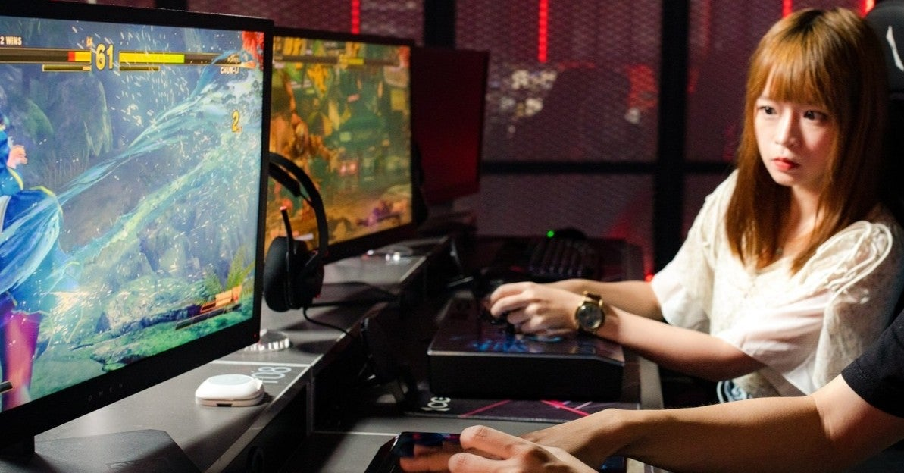

<figure>

</figure>

　ここのところ、立て続けにゲームメーカーによる配信禁止（？）の話題がニュースになっている。カプコンのゲームを無許可で配信したVTuber事務所が該当の動画を削除し、ゲーム配信サービスのミルダムは、任天堂のゲームに関して配信の許諾が得られなかったとして、今後任天堂のゲームは配信が行われないと発表した。また、日本一ソフトウェアの広報担当ツイッターアカウントでは、上手に言葉を濁しながら、上手く配信を行う方法を示唆している。（しかし一部の人々には理解されていない）

[null](null)

[null](null)

[null](null)

　ゲームは著作物であり、そのプレイを配信することの可否については、当然権利者の判断に委ねられる。ここが難しいところで、昔から細々と配信が行われている状況を、メーカーは知っていながら黙認している状況が続いてきていた。著作権を侵害した罪は親告罪であるが故に、著作者であるメーカーが黙認している限りは合法である。

　しかし、徐々にゲーム配信というものが一般的に広がりを見せるにつれ、この黙認状態というグレーゾーンに踏み込んでしまう人たちが出てきた。例えば、今回の日本一ソフトウェアの広報については、発表の場がSNS上ということもあり、即座に反応が返ってきている。

[null](null)

　要するにどこのメーカーも、企業としては著作物を自由に配信するなどということを許可するわけにはいかないのである。しかし、個人がプレイするものをインターネット等を通して動画として配信することは、そのタイトルの話題作りになったり、そこから口コミで人気が広がる可能性があったりして、できる限り潰してしまいたくないのも、また事実だ。その微妙な状況を上手に維持するために、これまで黙認という非常に曖昧で、しかしながら穏便なやり方を、メーカーは取ってくれているわけである。ゲームプレイを配信する人たちはその範囲内（その範囲も明確ではないのだが）で楽しみながら、過度に権利を侵害することなく、ゲーム実況／配信文化（？）とでも言うものを発展させてきたというわけだ。

　しかし近年、こうしたゲーム配信がYouTubeに代表される動画サービスサイトを通じて収益化され、その規模が大きくなると、今まで通りグレーゾーンで通せなくなってくる部分が出てきた。競うように新作ゲームをプレイする配信者達は、発売日当日にゲームのエンディングにたどり着き、ものの数時間でゲームに隠された謎は白日の下にさらされるようになってしまった。仕掛けを凝らしたストーリーも、ゲームを購入することなく、プレイすることなく誰もが知っているネット上の話題として消費され、攻略の難しい難敵も、配信者のプレイを見ることであっけなく突破されてしまう。結果ゲームの寿命は短命となり、ユーザーにあっという間に飽きられてしまう危険性が出てきてしまった。

　こうなると当然、メーカーとしても一定のルールの下に配信をしてもらうしかない。個人はともかく、規模の大きな法人や、動画サービスサイトには正式に許諾を得てもらうようになってきたのが現在の流れである。そしてそこに、前述したような個人で明確な基準を求める人たちが現れたのである。

　個人的には、10年以上のゲーム配信の流れを見ているだけに、あまり四角四面にルールを求めるような流れを作ってほしくないと思っている。個人で配信を行っている人たちが、そんなことを声高に叫べば、メーカーもきっと毅然とした態度で一律禁止をうたってくることは想像に難くない。それはあまりに窮屈で、配信する側だけでなく、見る側としてもあまり益がない結論である。できればそんなことになってほしくないと思いながら、ここ数日の騒ぎを眺めていた。

　突き詰めれば、ゲームは普通にプレイするだけでも楽しめるものなのである。配信は、プレイする方も見る方も楽しいが、必ずしもそれがゲームに必須の楽しみ方でないことだけは忘れないようにしたい。これまでの、どっちともつかない、ゆるーいゲーム配信を取り巻く環境に無くなってほしくないと思うのである。

**追記：メーカーが黙認していたわけではない、というご意見もいただいたので、リンク張っておきます。白黒つけたい人もいるということか。やれやれ。**

[null](null)
