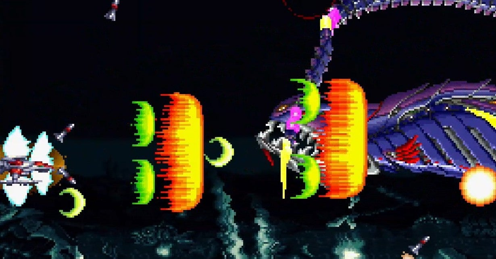

<figure>

</figure>

　以前**『ダライアス外伝』**の家庭用移植版を引き合いに出して、ゲーム環境のことを書いた。そして今、マイブームが来た。ついに**『ダライアス外伝』**のマイブームが来たのだ！　（いつまで続くかはわからない）

[https://note.com/keigox68000/n/n6d252b7df1d8](https://note.com/keigox68000/n/n6d252b7df1d8)

　**『ダライアス外伝』**が収録されている、任天堂スイッチ版の**『ダライアスコズミックコレクション』**は、発売直後にいろいろと不具合が見つかって物議を醸した。しかし、それに対して開発を担当したエムツーが徹底したテコ入れを行い、様々な便利機能を付加して、まったくの別ゲームと言っていいほどの素晴らしい移植ゲームに生まれ変わったのだ。

　特に素晴らしいのは、ステージを選択し、さらに自機のパワーアップやゲームのランクを任意に設定して練習ができるトレーニングモードを搭載したことだ。

　**『ダライアス外伝』**の1ステージは非常に短い。全7面をクリアしても、20分程度しかかからない。当時のシューティングゲームとしては、時間的にお手軽なゲームだ。それはつまり1ステージが短いということなのだが、短いが故に集中して練習すると、あっという間に上達する。同じ道中、同じボスをひたすら繰り返し、パターンを頭にたたき込むことが容易である。なんなら、クイックセーブを使って、ボス前でゲームを保存して、ボス戦だけひたすら繰り返すことも可能だ。

　そんなことをやっていたら、徐々にこのゲームの難敵であるクジラことグレートシングの攻略法が見えてきた。もちろん、そこにたどり着くまでにミスをしてしまうと、また復活パターンなどが必要になるのだが、徐々に財部の攻略を煮詰めていくことで、プレイが完璧に近くなっていく。

　この感覚である。これが、ゲームを攻略することの楽しみなのだ。**『ダライアスコズミックコレクション』**では、膨大な時間を割いてパターンを作っていかなければならないシューティングゲームが、部分部分に分解して効率よく攻略ができる。受験前の勉強をショートスパンで苦手部分を潰していくのに似ている。これなら、飽きっぽい僕にも攻略可能だ。

　というわけでここ数日、トレモ（トレーニングモード）を使ってステージとボスを練習し、少し自信がつくと通してプレイをしてみている。うん、通しプレイをするのは全国模試を受けるのに似ている気がしてきた。かようにゲームの攻略とは受験勉強にも似たストイックな行為であり、修行にも似た行動なのである。よし、今夜もがんばるぞ。

[https://www.youtube.com/watch?v=egU2ehhvsYk](https://www.youtube.com/watch?v=egU2ehhvsYk)
