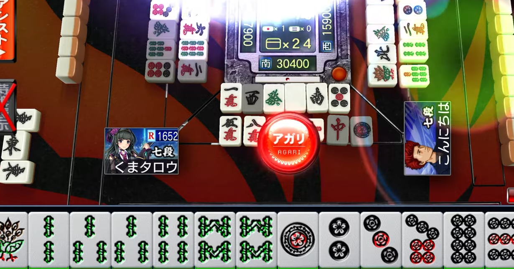

<figure>

</figure>

　最近すっかりご無沙汰だが、麻雀が大好きである。いや、ご無沙汰は嘘だな。オンライン対戦の麻雀ゲームは毎日のように遊んでいる。

　麻雀ゲームのプレイ動画をときどきYouTubeにアップしている。気持ちよく勝てたときなどは気分がよいので、つい動画をアップしてしまう。麻雀は運の要素が大きいゲームで、それで勝てたとしても嬉しくなって動画をアップしてしまうのだ。

　ところが、麻雀の動画はときとしてコメントが山のようにつくことがある。動画にコメントがつくと通知が来るので、こちらもなんだなんだとばかりに読みに行く。そうすると、これが実に様々なご意見のようなものが書かれていて楽しい。

　「ツモがいいから勝てただけだ」「ここで、これを切った意味がわからない」「対戦相手が弱いから勝てただけ」「自分の方がずっと上手い」などなど。まあ、要するにおっさんがビール片手に野球中継見ながら監督になりかわって、俺ならああだこうだとやる酔っ払いの下馬評のインターネット版だ。

　そんなコメントがついても全然かまわないので、楽しく読んで放置させていただいているが、こんなにみんなが自由にご意見できる麻雀というゲームの裾野の広さには感心してしまう。要するに、（麻雀をやったことがあれば）誰でも結果論でものを言い、確率が大きく支配するゲームだから絶対的なセオリーがなく、経験則で自由に自分の理論を組み立てられるゲームだから、意見が言いやすいのだ。

　これがもし、**『バトルガレッガ』**のスーパープレイだったら、なかなかご意見できないだろう。**『スプラトゥーン』**のガチ全勝ウデマエX動画でも、ちょっと口を挟みにくい。しかし、麻雀は違うのだ。誰でも小島武夫、誰でも桜井章一、誰でも阿佐田哲也である。自分ならこう打つ、あそこはこっちを切るべきだった。何を言っても通るのである。全ツッパオール通しのガバガバ立直みたいな世界である。

　しかし、だからこそ僕は麻雀の動画をYouTubeにアップするのだ。誰にでも自由な解釈が許され、好きなようにオレ流のご意見が言える動画。そんな世界は、ゲーム動画の中でも数少ないのかもしれない。あっという間に2万再生を超えた麻雀動画と、そのコメントを見ながら、そんなことを考えていた。

　さあみんな、麻雀動画にコメントしようではないか。これこそ言論の自由だ。

[https://www.youtube.com/watch?v=m7WuRPKHZtE](https://www.youtube.com/watch?v=m7WuRPKHZtE)

[https://www.youtube.com/watch?v=qja-N8vm4Q4](https://www.youtube.com/watch?v=qja-N8vm4Q4)
