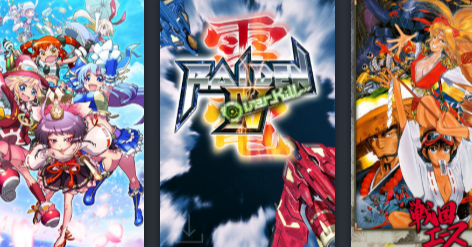

<figure>

</figure>

　Steamのクライアントを使ってゲーム管理をしていると、そこには様々な情報が表示される。フレンドが遊んでいるゲーム。ストアで安売りしているゲーム。フレンドの実績解除の状況。知らなくてもいいことだが、知るとちょっと楽しいことも多くて、Steamクライアントを起動するのは楽しい。

　そのSteamクライアントの情報の中に、「プレイネクスト」という項目がある。これは、持っているけどまだ遊んでいなゲームがこれだけあるよ、というちょっとお節介な機能だ。

　とは言え、せっかく買ったものを遊ばないのはもったいないので、ときどき覗くようにしている。ネットで話題になった8bit風の画面とチップチューンのBGMが有名なRPG。かつてXbox360で散々遊んだ魔女シューティングのPC版。バンドルでまとめて買ったけどどれも手を付けていない密室脱出系ADV。いつか腰を据えて取り組もうと買っておいた、数十面ある金塊奪取パズルゲーム。アーケードで稼働してちょっと人気だった美少女格闘ゲームの続編。3Dダンジョンをリアルタイムで冒険するRPGの続編（だけど前作をクリアしていない）。

　などなど、自分なら当然買うだろうと思いながら、今日まで遊んでいないのもうなずける事情のあるゲームばかりがずらりと並んでいる。

　別にこれらのゲームを今すぐプレイしなければいけない理由はないし、Steamクライアントがそれを強要しているわけでもない。むしろちょっとした親切機能だ。しかしそれでも、こうしてプレイしていないゲームを並べられるだけで、何か無言のプレッシャーのようなものを感じずにはいられない。

　わかっている。それはSteamがプレッシャーを与えているのではない。重圧と後ろめたさを感じているものは僕の心のなかにあるのだ。自分が勝手にプレッシャーを感じているに過ぎない。今はそれを遊ぶときじゃないんだ！　と強くはねつければ、ネクストプレイなどなんの意味もなさない、ただのゲームタイトルの羅列だ。

　それでも、持っているゲームはいつか遊ばねばならないという、一種の強迫観念がつきまとう。これは、棚に並べてある積みゲーも、クローゼットに押し込んであるアーケードゲームの基板も同じことだ。いつか遊ぼう。いつか遊ぼう。そう思って、すでに何年も、いや10年以上が経ってしまったゲームたち。そうした過去の自分の過ちにも似た何かと同じ後ろめたさを持って、自分自身がプレッシャーを作り出しているのだ。

　いや、実を言えばそんなに後ろめたくない。棚においたゲームも、クローゼットの上段に並べた基板も、全然気にしてない。普段目にしないところにあるゲームは全然僕にプレッシャーを与えてこないのだ。ときどき見て、ああ、こんなゲームもあったね。また遊ばなきゃね。ぐらいに感じているだけである。

　しかしSteamは違う。ゲームを遊ぼうとクライアントを開くと、いつでもそこにプレイネクスト。これだけやってないぞ！　と迫ってくるのである。これこそまさに視覚のなせる技。そこにあることを意識せざるを得ない仕掛け。このクライアントのデザインを考えたやつは天才か？　嫌がらせの。

　そう思って、今日も**『デッドバイデイライト』**を起動するのであった。さらば、プレイネクスト。
