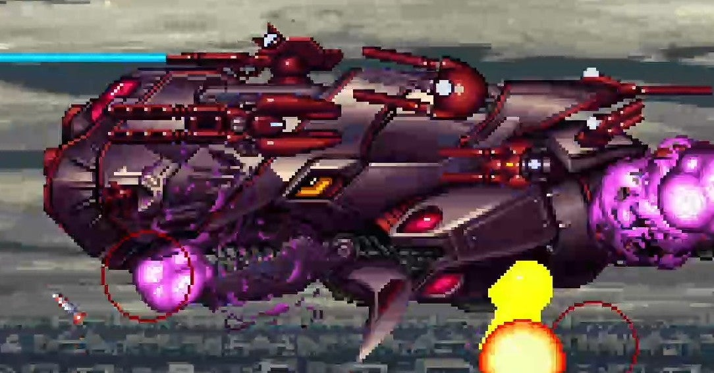

<figure>

</figure>

　シューティングゲームは遊びとしてプレイしているわけだが、決してお遊びではない。いつでも真剣だ。

[https://note.com/keigox68000/n/nce1f067d6f76](https://note.com/keigox68000/n/nce1f067d6f76)

　そして、真剣にやっているからこそ、スランプが訪れる。ついこの前までは面白いようにボスを倒し、先のステージへ進んでいたのに、ある日突然倒せないボスに行き当たる。避けられるはずの攻撃が避けられなくなる。まさにスランプだ。

　そういうとき、何をすればいいのか。しょせん遊びなので、世をはかなむほど悩んでしまうことはないが、状況を打開するために試してみることはいくつかある。

　ひとつめ。一番よくやるのは、人のプレイを見ることである。昔はゲーセンでプレイしている人の後ろに立つこと。今はYoutubeで動画を見ること。断然現在の方が、ゲーム攻略という視点からすると便利な世の中だ。でも、ゲーセンで直にプレイヤーを見ると、レバーの動きからボタンの押し方、タイミングを図る空気感まですべて感じることができる。いずれにしても、自分だけで打開できないときは先人の知恵を借りることも大きな助けとなることが多い。他人のプレイを見ることは、答えを見てズルをすることのように感じる人もいるかも知れないが、そんなことは全然ない。なんなら、人のプレイを見てそっくり真似をしてみるといい。そんな簡単な話ではない。

　ふたつめ。違うゲームで遊ぶ。いきなりずっこけないでほしい。これも大事なことだ。『ダライアス外伝』で行き詰まったら、『イメージファイト』で遊んでみることで、何か見えることがあるかもしれない。何も見えないことのほうが多いかもしれない。でも、すくなくとも同じゲームをやっていてうんざりした気持ちを束の間開放することはできる。これは間違いない。シューティングとシューティングで乗り気がしなければ、ぜんぜん異なるジャンルのゲームを遊んでみるのもいい。そうやって、根を詰めず、どこかでガス抜きしてやることも大切だ。これは本当。

　最後にみっつめ。あきらめて寝てみよう。だんだんいい加減なこと書いていると思っているだろう。いや、これも大いに本気だ。ゲームは遊びだ。嫌になったらさっさとやめて寝るのがいい。それがふて寝でも構わない。寝ればきっとゲームのことなんか忘れてしまう。そしてまた明日、新たにゲームをやりたいという気持ちが湧いていることだろう。もしかしたら、夢の中で攻略法を思いつくことがあるかもしれない。冗談だと思うだろう？　そんなことないのだ。僕は『ダライアス』を遊んでいた当時、タツノオトシゴのボス「グリーンコロナタス」が一向に倒せず、かなり苦労していた。しかし、ある日夢で、弧を描くように自機を動かす啓示を受けて、それで難敵を打開することだできた。まあ、夢に見るほどゲームやるのもどうかと思うが。

　さて、なんでこんなこと書いたかというと、日々ゲームをやりすぎて、いよいよ攻略に行き詰った感のあるゲームが数本。さてどうしようという状況になっている。自分でこの状況を打破するためにも、と思って、こんなことを書いてみた。明日はきっと攻略できるに違いない。寝よう。

[https://www.youtube.com/watch?v=egU2ehhvsYk](https://www.youtube.com/watch?v=egU2ehhvsYk)
