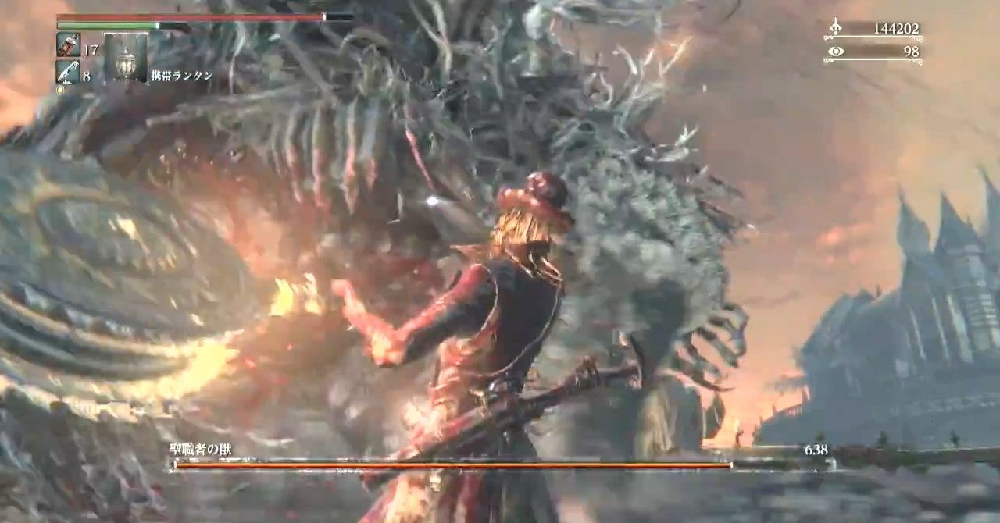

<figure>

</figure>

　PS4用に2015年にリリースされた**『ブラッドボーン』**。僕が今でもときどきプレイしたくなる紛うことなき名作ゲームだ。

　開発にはフロム・ソフトウェアが関わっているだけあって、同社の**『デモンズソウル』**や**『ダークソウル』**にも似た、一見さんお断り、硬派なアクションゲームとなっている。ゲームシステムにも随所に近しい点が見られる。

　しかし、**『ダークソウル』**などが中世ヨーロッパをイメージさせる世界観のダークファンタジー仕立てになっているのとは違い、**『ブラッドボーン』**ではもう少し新しい時代、ヴィクトリア朝時代をベースにしている。

　主人公は、巷に流行する「獣の病」によっておぞましい怪物に姿を変えた人々を狩る狩人という存在。変形することで複数の攻撃方法を持つ「仕掛け武器」と、獰猛な獣を怯ませるほどの威力を持つ銃器を両手に持ち、手数の多い軽快なアクションで並みいる敵を倒していく。

　おそらく、この仕掛け武器の変形ギミックと、多彩なアクションだけでしびれてしまうアクションゲーマーは多いことだろう。ある意味見慣れて飽きている剣と盾のメディーバルファンタジーとは一線を画す、これまでに見たことのない新しいアクションが楽しめる。とにかくモーションがかっこいいのだ。

　そして、何より魅力的なのが、この**『ブラッドボーン』**の世界を形作る重厚なストーリーだ。ゲームの中で説明的にストーリーが語られることはないが、言葉少ない人々との会話と、徐々に進行する世界を脅かす病の謎を推測させる登場人物から、物語の全貌がプレイヤーの考察によって浮かび上がる。この辺りの、プレイヤーに考えさせる手法は『ダークソウル』シリーズに近い。

　プレイヤーはエンディングに近づくにつれ、人々を蝕む獣の病の深刻さを理解し、その根っこが取り返しのつかないところまで入り込んでいることに絶望しながら最後の戦いに赴くことになるだろう。

　しかし、それはこのゲームの一面的な理解に過ぎない。ゲーム中、プレイヤーに設定されたパラメータのひとつに「啓蒙」という項目がある。これはその名の通り、プレイヤーキャラクターの蒙を啓き、今まで気づかなかったことに気づかせるためのパラメータだ。啓蒙のステータスを上げることで、プレイヤーは今まで行けなかった場所へたどり着き、このゲームのストーリーに隠された真実に近づくことができる。一方で、啓蒙を上げることは、真実と裏腹の狂気に触れることであり、ゲーム内で「発狂」と呼ばれるステータス異常を起こしやすくなり、いずれはゲームオーバーになってしまう。

　この二重構造に組立てられたストーリーにこそ、**『ブラッドボーン』**の真骨頂があり、その存在が、真のエンディングを迎えずには**『ブラッドボーン』**を攻略したとは言い難いものにしている。ネタバレを避けるためにこれ以上詳細に踏み込むことはやめておくが、ぜひすべてのゲーマーに体験してほしい重層的なストーリーだ。

　そんな**『ブラッドボーン』**だが、PS4で発売されて以降、それ以外の動きがない。後に発売されたDLCは、熱心なファンを満足させる出来であったが、それ以外に特に**『ブラッドボーン』**ファンを喜ばせるような情報は今のところ発表されない。それが残念だ。パブリッシャーがソニー・コンピュータエンタテインメントである以上、PC版のリリースは期待できないのだが、できれば高フレームレートでプレイできる**『ブラッドボーン』**は期待してしまう。同時に、できれば続編が遊びたい。今ちょっとそんなことを思っている。

[https://www.youtube.com/watch?v=ipt7E6se8fY](https://www.youtube.com/watch?v=ipt7E6se8fY)
