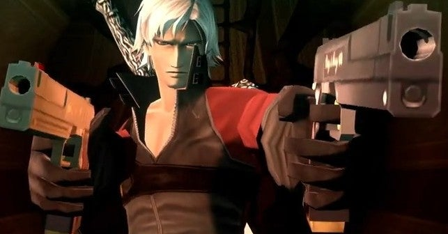

<figure>

</figure>

　まったくもって予言通り。

[https://twitter.com/keigox68000/status/1285840863784873984](https://twitter.com/keigox68000/status/1285840863784873984)

　以前noteにも書いたとおり、**『真・女神転生III NOCTURNE HD REMASTER』**に登場する葛葉ライドウと差し替える形で、DLCのダンテが使えるそうだ。

　ライドウファンには申し訳ないが、最初にライドウ版で若干のがっかり感を持たせておいて、後からダンテ登場！ってやる手法。あまりにあざといが、もちろんこういう盛り上げ方じゃなきゃダンテらしくない。当然そうくるよね。

[https://www.youtube.com/watch?v=CyKAgXbEX3A](https://www.youtube.com/watch?v=CyKAgXbEX3A)

　アトラス（とセガサミーかな？）は、**『ペルソナ5』**でも、自社IPを積極的に多方面のコラボに利用している。**『第五人格』『パズドラ』『大乱闘スマッシュブラザーズ』**等、数々のゲームにキャラクターが登場し、アパレルブランドなどにもコラボ商品が採用されている。また、一昔前には**『ペルソナ４』**のパチンコもあった。これだけコラボに熱心な会社が、ちょっと古い作品だからといって、売りになるダンテとのコラボをみすみすあきらめるわけがないじゃないか。

　そもそも、カプコンの**『ドラゴンズドグマオンライン』**でも**『ペルソナ5』**コラボの企画はあったし、今でもカプコンとは近しいメーカーなんじゃないだろうか。そう考えると意外でもなんでもないよね。

[http://mmofan.blog39.fc2.com/blog-entry-17455.html](http://mmofan.blog39.fc2.com/blog-entry-17455.html)

　なんなら、『ペルソナ５』のDLCみたいに、『女神転生if』コラボBGMとかも導入してほしいぐらい。いや、このBGMはもともと**『真・女神転生III』**にも使われているから必要ないか。

[https://www.youtube.com/watch?v=OwVgohglBQI](https://www.youtube.com/watch?v=OwVgohglBQI)

　それより、DLCでキャラクターが入れ替えられるなら、逆に『ペルソナ５』のキャラクターが**『真・女神転生III』**に登場するなんてことも……流石にそれはありえないかな。
