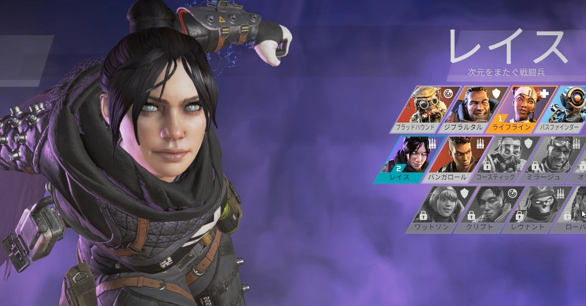

<figure>

</figure>

　ここ数日、以前少し遊んでいた**『APEX LEGENDS』**をプレイしている。FPSは好きなのだが、もう完全に下手の横好きだ。

　FPSというジャンルそのものが、どちらかと言えば撃ち合いをすることがメインの、単純明快なルールである。わかりやすく、誰にでも気軽遊べるのがFPSというジャンルの魅力ではないだろうか。

　一方で、単純なだけに、プレイヤーの技量がストレートにゲームの結果に反映されやすい。エイムが上手いか、立ち回りを理解しているか、そういうことがゲームの勝敗を支配する。もちろん、武器の特性や（そういう仕様であれば）キャラクターの得手不得手を考慮することも必要であるが、やはりヘッドショットの上手い人にはかなわない。

　そうなってくると、あまり言いたくないが、やっぱりゲームをプレイしていて年齢の差を感じるときがある。自分は視力がよく、ゲームにおける細かいエイミングも得意だが、立ち回りはどうにももたもたしてしまう。いや、そう簡単に年齢の差と言い切るのは早計かもしれない。それでも、昔と比べるとゲームの色々なところで動きがヌルくなっているのは感じる。

　もしかしたら、これは身体的な能力の衰えと言うよりは、気持ちの問題かもしれない。ゲームに勝利したからどうということはない。負けても笑って流せる。そういう余裕ある姿勢が、（大人と言えば大人だが）ハングリーさを無くして、ヌルいゲームプレイに甘んじる結果となってしまっているのか。

　この手のこと、特にゲームプレイの巧緻については明確な基準がないため、実際のところどうなのかはわかりかねる。でも、結果として散々なリザルトを見ていると、そんなことも考えてしまう。

　いや、やっぱりそれは甘えかな。自分がゲームと真剣に向き合っていないことに理由をつけて言い訳をしているだけかもしれない。別に、そこまで真剣にプレイする必要はないのだが、いつも言ってる通り、ゲームは遊びだがお遊びではない。もうちょっと真剣に結果を出せるぐらいプレイしてみよう。やはり、やるからには真剣勝負が楽しいというものだ。

　たかがゲームを遊ぶだけで、そんなことをあれこれ考えていたのだが、よし、考えていてやる気が出てきた。モチベーションが高まったところで、もう少しFPSに打ち込んでみよう。お盆休み、ご先祖様もお迎えしたし、残された休日に丁度いいテーマだ。よーし、がんばるぞ。
