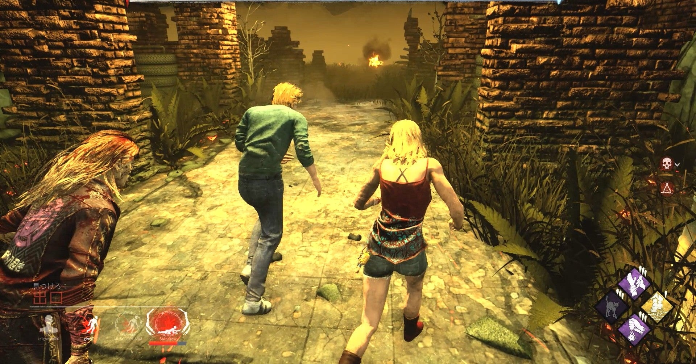

<figure>

</figure>

　稼働5年目にして、やっと**『デッドバイデイライト』**が機種を超えてクロスマッチで遊べるようになった。画期的だ！

　最近はどのプラットフォームにも同じゲームがリリースされることが多く、本当に機種を選ばずにゲームがプレイできるいい状況が整っているんじゃないかと思っている。昔なんか、どのゲームがどの機種でリリースされるかで戦争が起きるんじゃないかという勢いで論争が起きていたから、それからすると隔世の感がある。

　しかし、そんな状況にあっても、オンラインゲームで機種を超えてクロスプレイ／クロスマッチできるゲームは限られている。最近は増えてきたが、できないゲームも少なくない。

　そんな中で、つい先日**『デッドバイデイライト』**も4機種をまたいでのクロスマッチが可能となった。これで、PC,PS4,XBOXone,SWITCHの4機種のユーザーが入り混じって遊べるようになったというわけだ。ちなみに、このクロスマッチはオプションからオフにすることもできる。

　僕は最初**『デッドバイデイライト』**をPS4版でプレイしていた。知人がPS4で遊んでみたいと言っているのを聞いて、じぶんもやりたかったからそれなら一緒にやろう、ということで誘ったのが遊び始めたきっかけだ。その後、自分はPC版に移行してしまい、知人は相変わらずPS4で遊んでいる状況が続いていた。ときどきPS4で一緒にプレイすることはあったが、ほとんどは別の機種で別々に遊んでいる日々だった。

　それが、ここへ来ていきなりのクロスマッチ実装だ。早速PS4で遊んでいた知人にフレンド申請を送り、一緒にプレイすることとなった。

　なんだろう。久しぶりに懐かしい人と遊ぶような感じで楽しい。いや、いつもソロでやったりPCのフレンド遊ぶ**『デッドバイデイライト』**ももちろん変わらず楽しいんだけど、でも久しぶりの人と遊ぶと、また違った楽しさがある。

　多くの人が**『デッドバイデイライト』**は、チェイスをするゲームだと思っているフシがある。特に、動画サイトで配信しているプレイヤーは派手なチェイスを売りにして動画化しているような傾向があり、それに感化された人たちはとにかく走り回ってゲームをかき回すのが一番いいプレイだと思っている。

　しかし、このゲームはそう単純なものではなく、いかに効率よく発電機を修理するか。本来コミュニケーションを取れない仲間と、いかにしてパークや行動で一緒に作業を行って、キラーの間隙を縫って脱出をするか。そういう戦略性に面白さがある。

　特に知人とのプレイでは、救助への意識が高くなり、いかにしてキラーに捕らえられた仲間を、安全に救助して無事に逃すかということにも神経とを使わなければならない。クロスマッチで久々に遊ぶ**『デッドバイデイライト』**は、こころなしか救助に行かなければという義務感が強くなった感はあった。それがまた、よりプレイに磨きをかけ、どうやって全員で脱出するかということにつながっていく。これがクロスマッチをやって楽しかった要因の一つになっているのだろう。

　総じて**『デッドバイデイライト』**は仲間を助け、いかに仲間とともに脱出するかというゲームだと思っている。もちろんチェイスはその手段のひとつである。しかし、世の中の傾向として、自分ひとりがチェイスして、自分だけ脱出していくサバイバーも多い。本人はそれが楽しいのかもしれないが、それはマルチプレイヤーのゲームとしての楽しみは浅く、また戦略性にも乏しい。

　もちろんゲームだからその人の好きなように楽しめばよいのだが、自分としては、もっと多様な楽しみを見つけていきたい。そう思うのだ。それが、今回のクロスマッチの実装によってよりくっきりと浮かび上がってきた。

　まあ、これは僕自身の主観的な感覚なのだが。でも、そうやっていろいろな戦略を考えながら楽しむゲーム。それが**『デッドバイデイライト』**にゲームとしての深みを与えているのだと思う。

[https://www.youtube.com/watch?v=mRDU4jd3hG8](https://www.youtube.com/watch?v=mRDU4jd3hG8)
