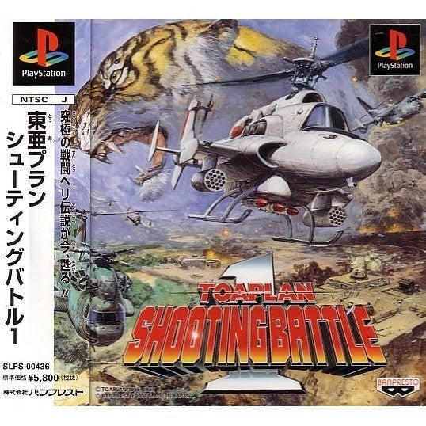

<figure>

</figure>

　近々、エムツーが移植／開発を担当した**『究極タイガー』**が発売されるらしい。なんでもそれに向けて秋葉原Heyでロケテならぬフィールドテストというのを行っている。

[https://game.watch.impress.co.jp/docs/news/1270688.html](https://game.watch.impress.co.jp/docs/news/1270688.html)

　以前PS4用に**『バトルガレッガ』**が発売される前にも、Heyでロケテが行われていた。そのときはわざわざ秋葉原まで足を運んで遊んでみた。そのときはプレイ中にゲームがフリーズしたりして、まあそれもご愛嬌なのだが、実際ゲーセンで実物をプレイすることでゲームの発売に期待感が高まったのも事実だ。

[https://twitter.com/keigox68000/status/809933626422935552](https://twitter.com/keigox68000/status/809933626422935552)

　実を言うと**『究極タイガー』**は、10年ぐらい前にアーケードゲームの基板を買い始めた頃に一番最初期に買った1枚だ。その昔ゲーセンでも繰り返し遊んで、それだけに愛着のあるゲームだったということだ。

　家庭用としては、1996年、プレイステーション用に**『東亜プラン シューティングバトル１』**として移植されていて、これも当時買った。ちなみにこのシリーズは１以降発売されていない。96年と言うと、東亜プランのゲームは一部マニアに人気があったぐらいで、それほど取り沙汰されているゲームメーカーでもなかったのだろう。

　とは言え、ゲーセンに**『究極タイガー』**が登場したのが1987年。それから9年も経って移植が出て、さらにそれから24年でまた移植されるということで、その根強い人気には驚かされる。もちろん僕もこのゲームのファンなので嬉しい限りだ。しかも今回はエムツーの極まった移植ということで、初心者に優しいモードや、練習モードにも期待が持てる。それが何よりも嬉しいのだ。

　思い出すと、**『究極タイガー』**がゲーセンで稼働していた当時よく遊んではいたが、当時は連射ボタンもなく、タイトーのゲーセンで使用されていたテーブル筐体はボタンが固く、どちらかと言えば地獄のようなプレイ環境で遊んでいた。6面、7面辺りへ到達するのがやっとで、未だに10面まで行ったことがない。**『究極タイガー』**のファンを名乗りながら、これは自分にとってちょっと忸怩たる思いであった。ゲーマーとして、好きなゲームを1周もしていないということにちょっと後ろめたい思いもあった。

　今回、家庭用として**『究極タイガー』**が発売されれば、家でじっくり攻略ができる。もちろん基板持っているんだから基板でやれよ、という話もあるのだが、やはりトレモ（トレーニングモード）的なものがあれば効率は上がる。今度こそ10面まで行きたい。そんな思いでいっぱいなのだ。

　未だ**『究極タイガー』**の発売日はアナウンスされていないが、エムツーのことだから、突如「明日発売します！」ぐらいの勢いで売り出すに違いない。その日を心待ちにしている。早く遊びたい、**『究極タイガー』**。

[https://www.youtube.com/watch?v=kfTMQ6QqKR8](https://www.youtube.com/watch?v=kfTMQ6QqKR8)
