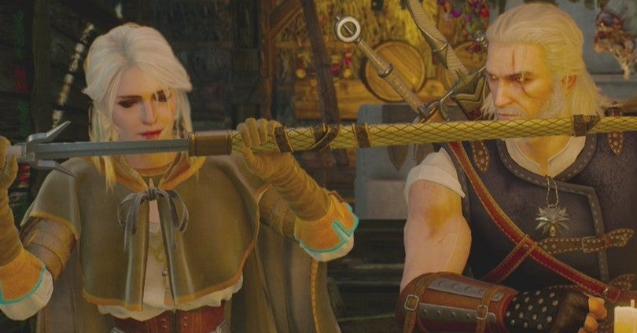

<figure>

</figure>

　オープンワールドのゲームが苦手である。オープンワールドのゲームがつまらないと思っているわけではない。自分がゲームの中のキャラクターになりきり、その世界に入り込めるオープンワールドのゲームは実に楽しいと思っている。いや、もっと言えば、オープンワールドというゲームは、ゲームにおける疑似体験、なりきりプレイの究極の形のひとつなのではないかと思っているぐらいだ。

　ゲームはあくまで仮想的な世界である。しかし、我々ゲーマーは、いつでもゲームの世界を、現実と同じように体験できることを夢見てきたはずだ。多くのゲームが、実在する世界やそれに付随して想像（創造）された空想の世界をよりリアルに近づけようとチャレンジしてきた。（もちろん、実在のものとはまったく関係しない、絶対音楽のようなゲームもある）

　オープンワールドは、こうしたゲームを現実世界のリアルに近づけるためのひとつの手法である。ゲームの歴史において、どの辺りからがオープンワールドと呼んでいいかは議論の余地があるが、いずれにしてもプレイヤーがゲームの世界の中をある程度自由に動き回り、まるでその世界の中で生活しているかのようにゲームをプレイできる。ゲームとして画期的なシステムである。

　もちろん、このオープンワールドというシステムをゲーム内で実現するには、様々な技術革新が必要であった。単純に広大な世界をゲーム内に作り上げるためのメモリ容量。世界がそこに存在するかのように視覚的（あるいは五感すべて）に表現するためのコンピュータスペック。場合によっては、他プレイヤーも同時にその世界に存在するためのネットワーク環境。そういうものが徐々に発達することによって実現したものだ。

　オープンワールドをただ歩くだけで楽しい。見て回るだけで新しい発見がある。それは純粋にオープンワールドゲームの魅力である。実際に遠くへ行くことができない人も、魅力的なゲームの世界を楽しむことができる。まるで世界中を旅行しているような気持ちにさえなるかも知れない。ゲームの体験は、ここに至るに本当に豊かなものになり、我々の感性に饒舌に訴えてくるようになった。実に素晴らしいことだ。

　しかしである。僕はそういうオープンワールドのゲームが苦手だ。何が苦手かって、ゲームが終わらなくなってしまうのである。行ける場所がたくさんある！　楽しい！　こっちにこんなクエストがある！　どうやって行くのかわからなかった場所へ行くための道が見つかった！　そんなことをやっているうちに、本来の目的は忘れ去られ、サブクエストやらなんやらに忙殺されるうちにだんだんゲーム内の世界に満足して、やがて興味がフェードアウトしてしまうのだ。

　例えば**『ウィッチャー３』**はクリアしたものの、途中でプレイが中断して数カ月間放置状態になった。これはいけないと再開して、とにかくメインのストーリーのみを追ってなんとかエンディングまでたどり着いた。**『ゼルダの伝説 ブレスオブザワイルド』**は、膨大な数の祠を探しているうちに、自分でも飽きが来ていることを自覚して、このままではクリアできないと、祠探しを中断してボスを倒すことに集中した。**『デス・ストランディング』**は、あれほど楽しくプレイしていたのに絶賛放置中だ。ストーリーの行く末が気になるー。**『スカイリム』**は、３回ぐらい最初からプレイし直して、またもや挫折している。

　とにかく、それぐらいオープンワールドのゲームはクリアできない。ゲームの内容が盛りだくさんで、自由度が高いと言えば聞こえはいいが、自分が今どこに集中すべきなのかわからなくなってしまう。もう、これは本当に自分の性格の問題なのだが、とにかく苦手だ。なんとかしたい。なんとかしてほしい。

　なんでこんなことを書いたかと言うと、今日からいよいよ**『ゴースト・オブ・ツシマ』**をプレイするからなのだ。できればクリアできますように……
