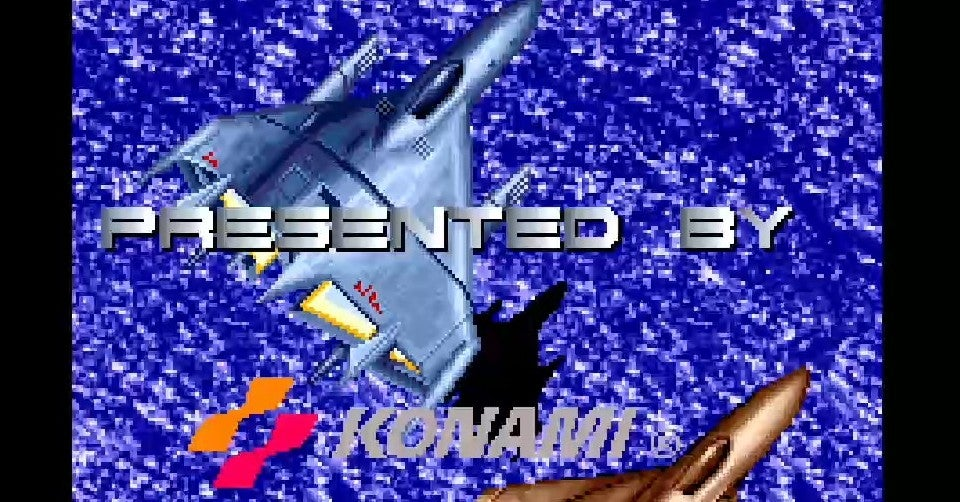

<figure>

</figure>

　**『トライゴン』**はコナミが1990年にリリースしたシューティングゲームである。コナミらしく、スマートでノリのいいBGMと、近未来的なデザインのメカニックが魅力の素晴らしいシューティングである。

　しかし、このゲームには決定的な欠点があった。それは、自機の当たり判定があり得ないほどデカいのである。古いシューティングゲームには、当たり判定が大きくて、弾の間をすり抜けるなどという芸当が不可能なものが少なくないのだが、それにしたって当たり判定デカすぎるだろうというのが、この**『トライゴン』**最大の欠点だ。

　コナミには、この手のどこかバランスの崩れてしまったシューティングゲームがいくつか存在する。個人的には、やはり当たり判定の大きい**『A-JAX』**、簡単すぎて眠くなる**『サンダークロス』**、ストレスフルなパワーアップの**『フラックアタック』**、そして**『トライゴン』**。この4つのシューティングが、「コナミ曲だけかっこいいクソシューティング四天王」だと思っている。

　**『トライゴン』**は、長らく家庭用に移植がされていなかった。僕は、そのちょっとクソゲーなところも含めてこの**『トライゴン』**というゲームが好きで、ゲーセンで稼動当時は苦戦しながらも1周クリアした思い出もあって、基板を買って遊んだりしていた。

　しかし、なんと30年経った今日、**『トライゴン』**が突如家庭用に移植されたのだ。PS4のアーケードアーカイブスのラインナップとして蘇った**『トライゴン』**。まるで夢のようだ。いや、よくよく考えてみると、これで**『A-JAX』『フラックアタック』『サンダークロス』『トライゴン』**の四天王がすべて家庭用として遊べるようになってしまった。嗚呼、苦心して基板を買った日々は何だったのか。いや、これは願ってもない僥倖。素晴らしい時代に僕らは生きている。

　ところが、いざアーケードアーカイブスの**『トライゴン』**を起動して驚いた。なんと、ゲームオプションに「当たり判定を小さくする」という項目があるのだ。なんというかゆいところに手が届く移植。**『トライゴン』**からデカい当たり判定がなくなったら、本当にただの名作ゲームになってしまう。

　早速当たり判定を小さくして、さらに難易度を優しくして遊んでみた。おお、なんということだろう。もう何年もプレイしていなかった**『トライゴン』**がサクサクと先の面へ進むではないか。パターンを忘れた今でもステージ7までたどりついてしまった。

　どうやら、30年経って蘇った**『トライゴン』**は、完成されたゲームへと転生したようだ。この喜ばしい日に乾杯。そして今こそ『トライゴン』を攻略しようではないか。ありがとう、アーケードアーカイブス。ありがとう、ハムスター。

[https://www.youtube.com/watch?v=gkseY-FzkRs](https://www.youtube.com/watch?v=gkseY-FzkRs)
