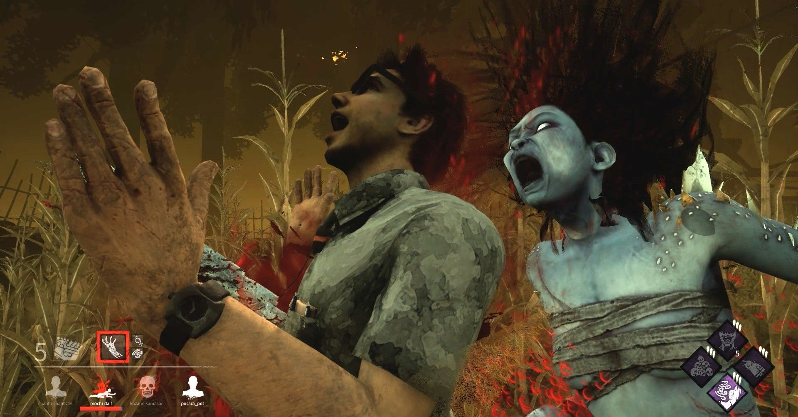

<figure>

</figure>

　**『デッドバイデイライト』**で発生している同期エラー。これによって、プレイ後に取得できるはずのポイントが空中に霧散し、泣きを見たユーザーも多いはずだ。

　珍しく、公式からの詫び石としてゲーム内のスキルやアイテムを入手するためのブラッドポイントが大盤振る舞いして全ユーザーに配布されたようだ。

[https://twitter.com/DeadbyBHVR\_JP/status/1298624528919273472](https://twitter.com/DeadbyBHVR_JP/status/1298624528919273472)

　**『デッドバイデイライト』**は、その初期からバグの多いゲームだ。5年目に突入した今も、相変わらずバグが多い。初期から直ってないバグもあるし、新機能を実装したために新たに生まれたバグもある。今日は、地面にハマるバグのおかげで、何もできずにキラーに捕まって死亡した。

　それでもゲームを続けるユーザーは、まるで修行僧の如き純粋さとひたむきさを持ち合わせているとしか言いようがない。**『デッドバイデイライト』**というゲームは、精神修養の場なのかもしれない。

　日本版公式サイトには、雑談掲示板が設けられているが、こちらも精神修養のあり方について議論が進められている。先日は**「運営様。何を楽しみにキラーをプレイすればいいのでしょうか？」**などという、信者の苦しみをそのまま文字にしたかのような投稿がされていた。（なぜかnoteからリンクから貼れないので、URLを記述しておく。精神修養の場に触れるなというお達しかもしれない。）

[https://forum.deadbydaylight.com/ja/categories/free-talk](https://forum.deadbydaylight.com/ja/categories/free-talk)

　そして、この信者の苦しみに対して運営から、**「逆にお聞きしたいんですが、なぜ『楽しめない』と思うんでしょうか？」**などと冷たく突き放すような回答が臆面もなく書かれてしまう様は、まるで修行に耐えられず弱音を吐いた信者を、千尋の谷に突き落とす教祖の厳しさをまざまざと見せつけられたかのような地獄絵図だ。日本の運営は人の気持ちが理解できないのかとさえ思ってしまう。

　個人的には、ひたすらプレイして攻略法を掴むことがゲームの楽しみであり、そして**『デッドバイデイライト』**にはその楽しみの余地があると思っている。しかし、心折れた者に追い打ちのように厳しい言葉を投げかける運営の姿を見ていると、その考え方がゲームバランスの調整にも大いに反映されているのではないかと思ってしまう。

　果たしてこれからこの精神修養の場はどのような発展を遂げるのか。それとも、心折れた信者たちの怨嗟の声にまみれ、ついにはユーザーの要望に答えられないゲームと成り果てるのか**。『デッドバイデイライト』**はYouTubeで動画が配信されるのみの、ただの「見るゲー」と化してしまうのか。

　まだまだ予断を許さないゲームである。楽しいぞ、**『デッドバイデイライト』**
