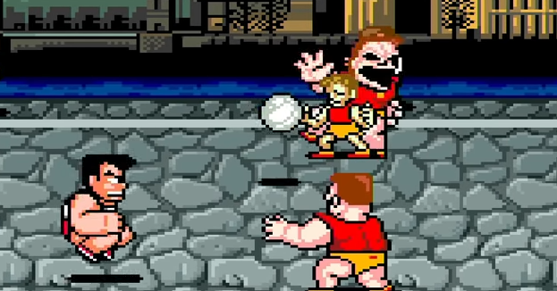

<figure>

</figure>

　任天堂スイッチのアーケードアーカイブスで**『熱血高校ドッジボール部』**が配信された（PS4では配信済み）。かつてゲーセンで大人気を誇った**『熱血硬派くにおくん』**のキャラクターが登場する、ドッジボールゲームだ。各キャラクターの頭身も低くなって、かわいらしい感じにアレンジされている。

　この**『熱血高校ドッジボール部』**も、**『くにおくん』**同様、一定の人気を得たようだ。当時どこのゲーセンにもたいていは置いてあったし、並んでプレイ待ちというほどの人気ではないものの、いつも誰かが遊んでいた印象がある。

　僕もプレイしたが、僕の場合はあまりハマらなかった。なぜかと言えば、肝心のドッジボール部分で、どの程度の強さでボールが当たるとやられるのか。敵チームの強烈なボールをキャッチできるタイミングや条件はなんなのか。それがひと目見てわかりにくかったからである。

　これがシューティングゲームなら、弾が当たったから死ぬ。地形や敵に接触したから死ぬ。と言ったことが、（たまに例外はあるけど）わかりやすくルール化されているから、納得してプレイできる。しかし、ドッジボールにおいて、特にボールが当たったときに、それがキャッチされるか否かが、ゲームの内部的な何かによって、秘匿されたまま決定されるのが**『熱血高校ドッジボール部』**の（僕にとって）わかりにくいところなのだ。そのもやもやとした感じがあまり好きになれずゲーセンではほとんどプレイしなかったというわけだ。

　しかし、ある日**『熱血高校ドッジボール部』**は、X68000用に移植される。こちらはなぜか結構ハマって遊んだ。要するに100円入れているかいないかの違いであるのだが、それに加えて、家に友人を招いての対戦プレイは結構盛り上がった。相変わらずボールがヒットするかキャッチされるかのジャッジはよくわからなかったが、対CPUではなく、仲間と一緒にわいわいやる上では、その曖昧さがあまり気にならなくなってしまったのだ。

　そんな感じで、ゲーセンでは遊ばず、家でよく遊んだ**『熱血高校ドッジボール部』**だが、対戦プレイを重ねるとなんとなくキャラクターの体力とか、ボールが当たるときがわかってくる。キャラクターの見た目とか角度とか、いろいろな視覚情報から、そういうことをなんとなく理解できるようになってしまった。なんとも感覚的なゲームであった。こういうプレイして培われる感覚もゲームの醍醐味なのかもしれない。

　そんなわけで、未だに釈然としない**『熱血高校ドッジボール部』**。一番釈然としないのは、その後にリリースされた**『熱血高校ドッジボール部 サッカー編』**という、もはやなんのスポーツなのかよくわからないタイトルなのかもしれない。
