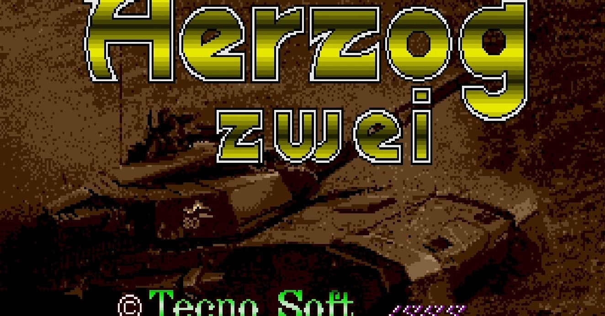
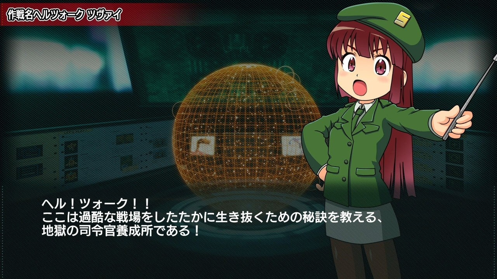
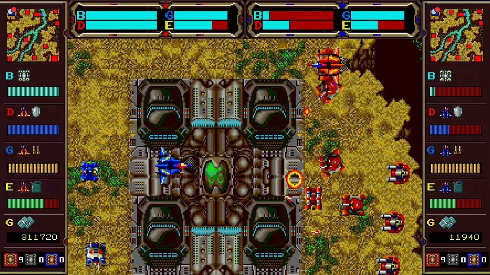
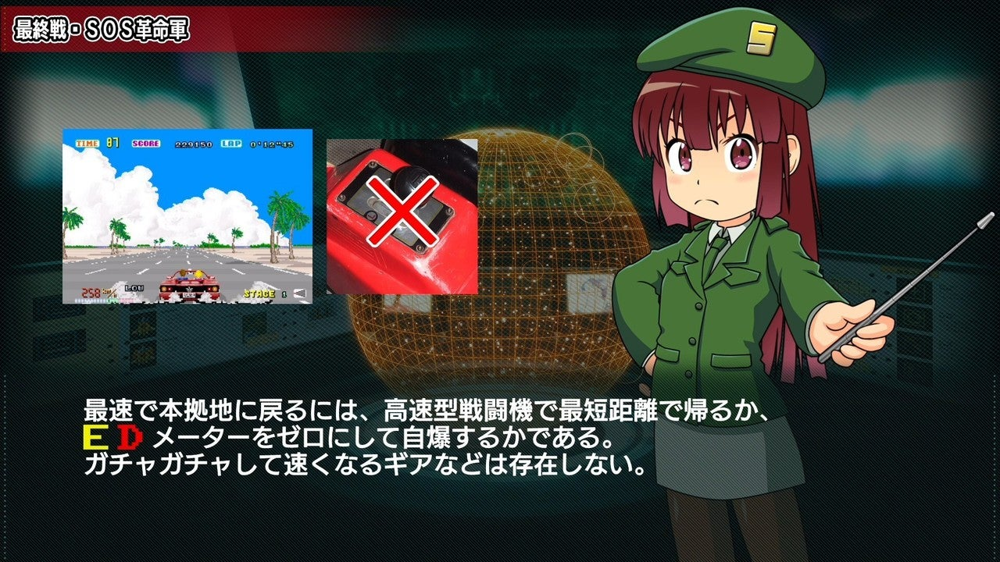
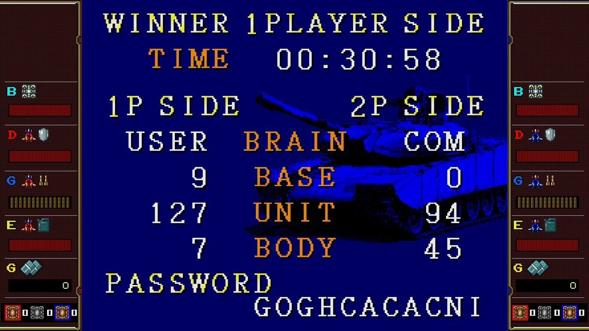

<figure>

</figure>

　いや、そこで切る単語じゃないだろ。

　というわけで、**『ヘルツォーク ツヴァイ』**の話題だ。**『ヘルツォーク ツヴァイ』**は、1989年にテクノソフトがリリースしたメガドライブ用のゲーム。

　このゲームはいわゆるRTSで、リアルタイムにフィールド上に自軍ユニットを配置し、マップ上に散らばる基地を占領、生産力を高めて敵軍本拠地を攻め落とせば勝利するという単純なルールだ。ちなみにヘルツォークは「公爵」を意味するドイツ語である。ツヴァイを名乗っているが、第1弾がどこかに存在するのかどうかはよく知らない。

　僕はこのゲームを自分では買っていないが、友人に借りて遊んだ。しかし、当時あまりの難しさにほどなく投げ出してしまった。**『ヘルツォーク ツヴァイ』**はRTSとは言え、あまりに忙しく、そして難しいシミュレーションゲームなのだ。

　そもそも自軍を配置して敵と戦うのだが、各ユニットを置くためには、自分で操作する自機を使ってユニットを運搬しなければならない。この自機は飛行形態とロボット形態を切り替えられる可変戦闘機なのだが、20秒も飛行しているとエネルギー切れで大破してしまう難物で、ユニット運搬中に爆発しようものなら、大枚叩いて生産した大切なユニットもろとも戦場の藻屑と消えてしまう。

　ユニットの中には自機に制空権を取らせまいと対空攻撃を行うものもあり、自機が敵対空ユニットの真っ只中に突っ込もうものなら、ものの数秒で撃墜されてしまう。そもそも、飛行形態で飛んでいるときには地上にいる敵ユニットには攻撃できないので、制空権などという概念は存在しない。自機に可能なことは、せいぜい敵陣の戦闘配備がどの程度まで拡張されているか覗いてくる偵察任務ぐらいだ。

　しかし、そんな難儀な自機も、ロボットに変形することで地上に配備された敵ユニットを攻撃できる。無敵のロボ大活躍！　と行きたいところだが、これも敵戦車や固定砲台が多数存在すれば、あっという間に撃破されてしまう。だいたい、敵側にも自機と同じ変形戦闘機がいるので、敵陣での戦闘は圧倒的にこちらが不利だ。これ、単に自機をロボットに変形させたかっただけに違いない。

　そんなわけで、『ヘルツォーク ツヴァイ』は、シミュレーションゲームとしてはちょっとプレイアビリティに難があり、戦略を考えると言うよりは、自機の少ないエネルギーが使える時間内に忙しく自軍ユニットを配置する、アクションゲームの要素が大きい。敵基地に攻め込む準備ができても、もたもたしているとあっという間に敵軍に巻き返される。戦車ユニットを休みなく、次々に敵地へと送り込める操作上の器用さがなければ勝つことのできないゲームなのだ。

　今回、任天堂スイッチ用のSEGA AGESのラインナップとして**『ヘルツォーク ツヴァイ』**が復活した。こだわりのエムツー移植らしく、プレイの導入には懇切丁寧なチュートリアルが用意されていて、それだけで買う価値がある。現代のゲームに慣れたユーザーの前に、いきなり当時の**『ヘルツォーク ツヴァイ』**を提示すれば、99%以上のプレイヤーがゲーム開始５分で投げ出すことは必至だ。この「ヘルツォークアカデミー」と銘打たれたチュートリアルはすごくいい試みだと思う。

　しかも、同社の2Dキャラクターを生き生きと動かすためのアニメーション技術**『e-mote』**を使った女の子教官を取り入れて、マニア受けバッチリのチュートリアルに仕上がっていて、早速SNSなどでオタク受けしている。ウルトラスーパービッグマキシム、グレートストロングバッチリという印象だ。

　30年前に放り出した僕も、このチュートリアルと、親切な難易度設定のおかげで、今回初めてステージクリアすることができた。これもエムツーによる移植のおかげだろう。

　さあ、みんなも一緒に。**ヘル！ツォォォォォォォォォォォァーク！！**

　いやあ、オタク受けいいなあ。

動画

[https://www.youtube.com/watch?v=ZCk-S4LORgk](https://www.youtube.com/watch?v=ZCk-S4LORgk)
