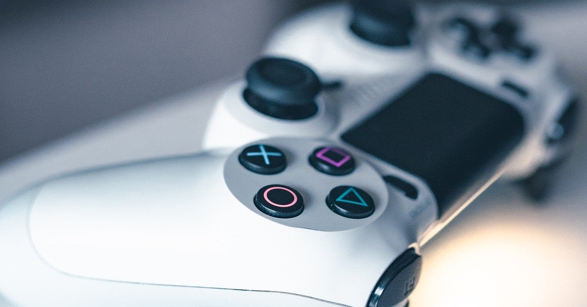

<figure>

</figure>

　PS5はPS4の互換機能しか持たないのではないかという情報が話題になっていた。

[https://automaton-media.com/articles/newsjp/20200901-135411/](https://automaton-media.com/articles/newsjp/20200901-135411/)

　ゲーム機の後方互換性は、新機種が出るたびに話題に上がるホットなニュースだ。それだけ、過去のゲーム資産のウェイトが大きくなり、ユーザーがいつまでも名作を遊びたいという気持ちを持つようになってきたということだろう。

　しかしながら、ゲーム機に後方互換性を持たせるということは、ユーザーが考えている以上にメーカーにとっては諸刃の剣になりかねない。ユーザーが過去のゲームに熱中するということは、その分新作ゲームが売れないかもしれないからだ。そんなことはない、昔のゲームもやるけど、新しいゲームも買うよ、と人は言うかもしれない。しかし、過去のゲームを遊んでいれば、新しいゲームを遊ぶ時間は確実に減る。メーカーとしては、やはり新しいゲームで遊んでもらいたいとこであろう。

　さらに、後方互換性の難しいところは、過去のゲーム機のスペックをどれだけ再現できるかという「再現度」の問題もある。せっかく昔のゲームを動かしても、画面がボヤケていたり、インターフェースの入力タイミングが異なったり、あるいはサウンドが昔とちょっと違う音で再生されたり、などということがあると、これはユーザーとしては満足できない。特に、昔のゲームをプレイしたいなどと言う、こだわりのゲーマーは、余計にそういう細かいところに目が行くものだ。

　個人的には、PS5がPS4と互換性を保ってくれるのはありがたい。せっかく買いためたアーケードアーカイブスなどが、引き続きしばらくは遊べる環境が整うということになるからだ。しかし一方で、今PS1やPS2のゲームを遊びたいかと言われると、実はそれほど思い入れのあるゲームはないのかもしれない。当時楽しくてハマったゲームを思い浮かべても、今となっては少々面倒で遊ばないだろう。なんとなく矛盾しているが、それが正直な気持ちだ。いや、これは僕自身のアーケードゲームに対する思い入れによる温度差かもしれない。そういう個人的な思い入れの差があるから後方互換は、単なるスペックを超えた部分で難しいのだ。

　初代プレイステーションが発売されてから26年の時が過ぎた。果たして今から26年後に、現在のゲームを遊びたいと思うのだろうか。その頃にも、ゲームファンはPS4やPS5のゲームを遊ばせろ！　と叫んでいるのだろうか。

　おそらく、僕自身はその頃はもうゲームが遊べない体になっているかもしれない。やっぱり、後方互換は前世代のマシンぐらいまでで十分だ。
