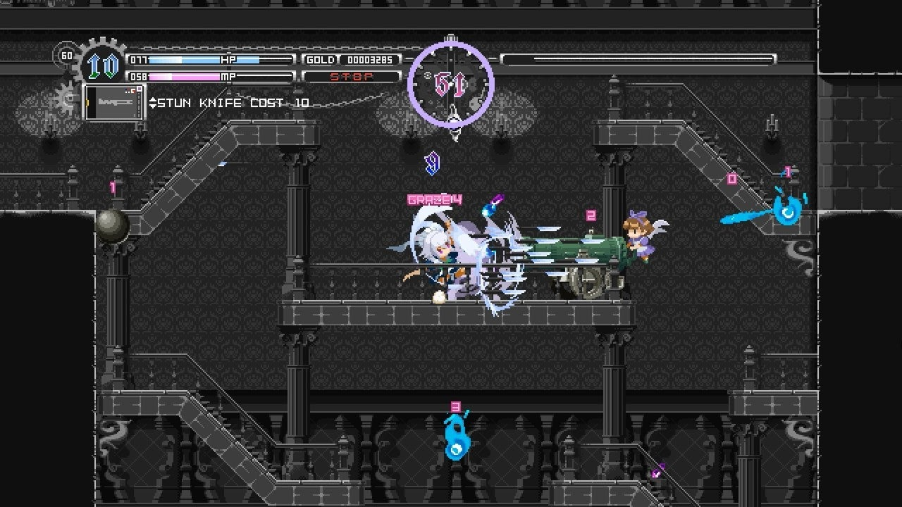
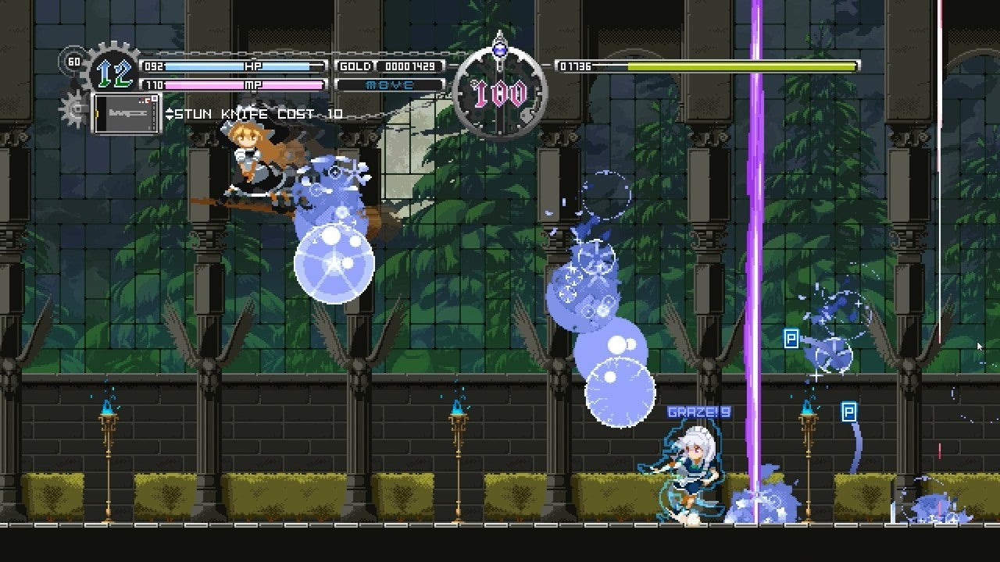

<figure>

</figure>

　**『東方ルナナイツ』**は、2018年にSteamで早期アクセスとしてリリースされたメトロイドヴァニアなアクションゲームで、2019年には正式リリースとなっている。ずっとSteamのウィッシュリストに入れてあったのだが、なんといつの間にかXbox Game Pass for PCにラインナップされていた。要するに、Game Passに加入していれば買わなくても遊べるということだ。

　東方シリーズはそれほど思い入れはないのだが、それでもいくつかのタイトルをプレイしているので、なんとなくキャラクターは知っている。まあ、知らなくても楽しめるゲームじゃないかと思う。ドット絵で描かれた大きめのキャラクターがよく動き、操作レスポンスも良好。何よりも、ゲームシステムがわかりやすい。

　主人公の十六夜咲夜は、時間を止めて多くのナイフを投げる技で攻撃する。これは原作のシューティングゲームでも同じ。それが、アクションゲームにも上手く生かされている。プレイヤーは、HPとMPというオーソドックスなステータスを管理しながら、時を止める時計にも注意を払わなければならないところが、目を引くシステムだ。

　純粋にアクションゲームではあるが、やはり原作の要素を多分に取り入れていて、シューティングゲーム的な動きをする敵も多い。そこがプレイしていて楽しい。迷路は（序盤をプレイした限り）割と平易に作られていて、ルートやマップ構成で悩んで行き詰まるようなことはあまりない。敵の配置も嫌らしくなく、それでいて、十六夜咲夜の能力をきちんと使わないと通り抜けられないギミックがきちんと配置されていて、丁寧に作り込まれているのを感じる。

　特にボス戦においては、ボスキャラの各攻撃をどうやって避けるかがポイントになっていて、パターンを作っていく楽しさが用意されている。こういうのがあると、ゲームがおもしろくなるのだと実感できる。まだ、2人のボスキャラに出会っただけだが、この先の攻略も楽しみになってくる。

　どうやら、クリアまでに要する時間はそれほど長くないようだ。昨今、ゲームはボリュームがあることがよしとされる傾向もあるが、ライトウェイトなゲームもあっていい。

　インターフェースやセーブのシステムも洗練されていて遊びやすい。きっとファンにとっては、原作のBGMをアレンジした楽曲も嬉しいところであろう。

　そう言えば、このゲームが任天堂スイッチ用にリリースされるというニュースも見たような気がするのだが、その後どうなったのだろう。まだリリースされていないような記憶があるのだが、今後発売されるのだろうか。気になるところだ。

[https://www.youtube.com/watch?v=JTahxt3qGlE](https://www.youtube.com/watch?v=JTahxt3qGlE)
