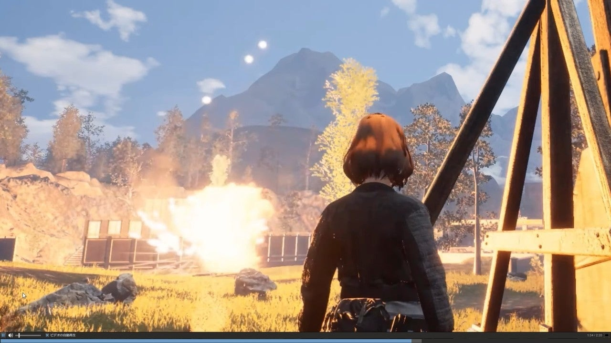
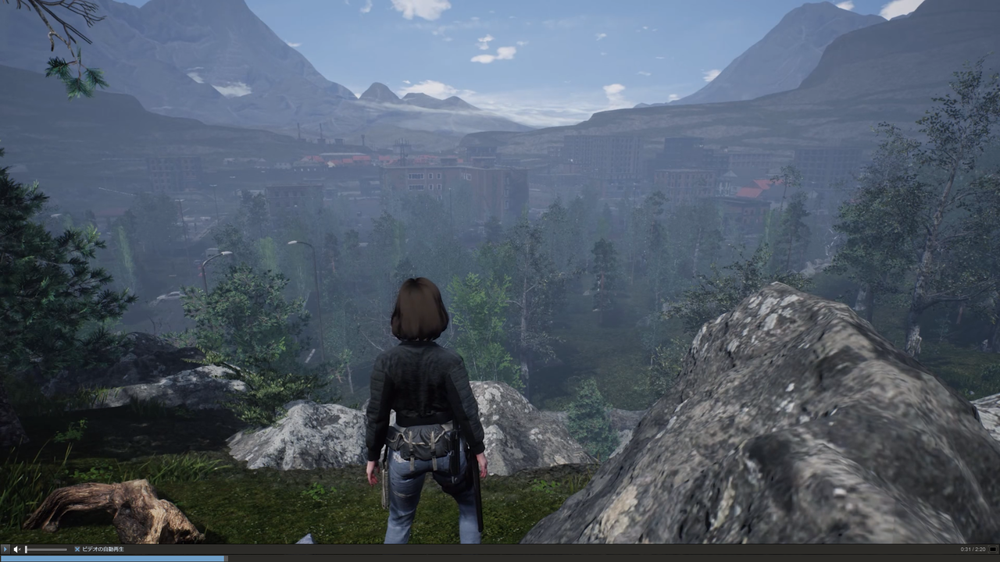

<figure>

</figure>

　今気になっているクラフト系ゲームが2本ある。ひとつは、**『クラフトピア』**。もうひとつは、**『ナイト・オブ・ザ・デッド』**だ。

　**『クラフトピア』**は、広い世界で狩りをし、素材を集め、物を作り、作物を育てるゲームで、本当にその世界で生活をしていくかのような遊びができるスパンの長いゲームだ。どうやら、明確な目的はないのだが、ダンジョンを探検したり、釣りをしたり、プレイヤーによって日々の糧を得る方法は千差万別。とにかくできることが豊富に用意されているのが売りである。

　グラフィックは、明らかに**『ゼルダの伝説 ブレスオブザワイルド』**に影響を受けたような美しいテイストで描かれ、早期アクセスのゲームとしては、高い完成度でスタートしたと言える。一方で、早速YouTubeなどに上がっている動画を見ると、結構バグが出たりしている。この辺りが解決されて正式アクセスとなれば、名作ゲームになりうるのかも知れない。

　**『ナイト・オブ・ザ・デッド』**の方は、タイトルからなんとなく内容が推し量られるかもしれない。その通り、襲い来るゾンビから拠点を守る、タワーディフェンス型クラフトゲームだ。

　プレイヤーは、ゾンビがあふれかえり、廃墟となった世界をめぐり、様々な素材を手に入れる。それを組み合わせることで自分が安全に過ごすための拠点を作り、ゾンビを撃退するための罠を設置する。定期的にラッシュで攻めてくるゾンビを数々の罠でなぎ倒すプレイは、まるでタワーディフェンスそのもの。それでいて、ときには動物を狩り、飢えを凌ぐサバイバルゲームとしての一面も併せ持つ。こちらも非常に自由度の高いゲームと言える。

　どちらも実に楽しそうなのだが、いかんせんベースがクラフトゲームということで、作業的な要素が大きいのが難点。編集され、ダイジェスト的に見ることができる動画では楽しそうなのだが、自分でプレイしたときに根気がどこまで持つのかは実に心配である。

　そんなことを思いながら、今この2つのゲームに手を出そうか、どうしようか、悩んでいるのであった。我ながら、単純な悩みだ。

