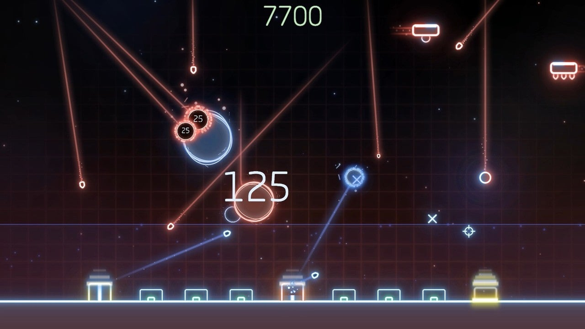
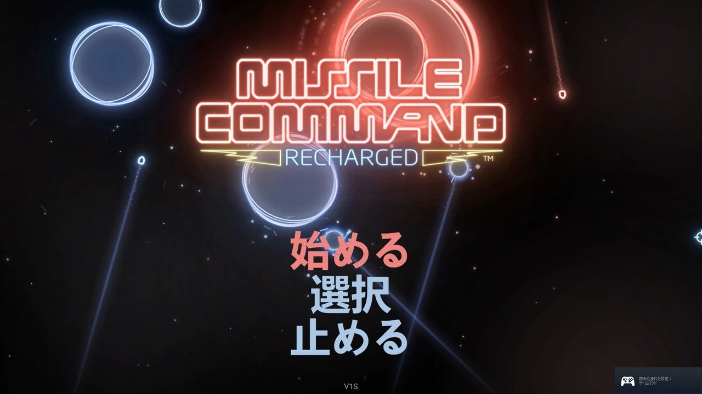

<figure>

</figure>

　**『ミサイルコマンドリチャージ』**は、今年の5月にリリースされたゲームだ。もちろん、その名の通りATARIの**『ミサイルコマンド』**をベースとしたリメイク作品である。

　このゲームの元になっている**『ミサイルコマンド』**のことを思い出してみると、当時日本国内でもかなりの流通があったのか、割とよくゲーセンで見かけた。ほとんどがアップライト筐体で、今となると貴重な専用筐体で遊べていたのかなと思っている。僕はなぜかこの**『ミサイルコマンド』**が好きでよく遊んだ。ICBMとABMによる近代戦を、シンプルなラインや円で表したゲーム画面は当時の僕にはとても美しく感じられた。トラックボールと3ボタンという独特の操作系統もあいまって、実に未来的なゲームで遊んでいる気がしたものだ。

　その**『ミサイルコマンド』**のリメイクが、この**『ミサイルコマンドリチャージ』**というわけだが、**『ミサイルコマンド』**のリメイク自体はときどき現れるのでそれほど珍しくないような気がする。でも、何回登場しても遊んでしまうのが**『ミサイルコマンド』**だ。これはひとえに、少年時代の美しい思い出がその原動力となっていることは間違いない。

　さて、**『ミサイルコマンドリチャージ』**だが、基本的なルールは原作を踏襲しているものの、いろいろと違っている点も多い。

　まず、ミサイルを撃つための照準をマウスで操作するのは順当な線として、ミサイル発射はマウスの1ボタンのみだ。3台ある砲台の一番近いものが自動で選択される。ただし、次のミサイル発射までにはリロード時間が設定されているため、一番近い砲台から連続発射することはできない。これによって、ミサイルを乱発して強引に敵の攻撃を防ぐことはできなくなっている。ある程度の戦略が必要というわけだ。

　また、砲台にリロード時間が設定されている代わりに、ミサイルの弾数は無限となっている。ときには砲台が破壊されることもあるが、原作ではステージをクリアすることで砲台が復活したが、本作では時間によって自動的に砲台が復活してくる。その代わり、ステージの概念はなくなっている。

　さらに、ゲームオーバーになると獲得したスコアによって、プレイヤーは自軍のグレードアップが可能だ。ミサイルの爆雲の大きさ、砲台リロードの時間、ミサイルの速度、破壊された砲台の復活時間を選択してアップグレードできるため、次のプレイではさらに快適なゲーム展開が望める。

　ゲームの外見としては、**『ミサイルコマンド』**が普通のドットで描画されたゲームであるのに対し、**『ミサイルコマンドリチャージ』**はベクタースキャン風の光り輝くグラフィックにアレンジされていたり、リズミカルなBGM（どこか**『ジオメトリウォーズ』**にも似ている）が流れたり、心地よく遊べる工夫がなされている。

　しかし、様々なアレンジを加えながら、**『ミサイルコマンド』**らしさを失わず、ちょっとした時間で気軽に遊べる良作に仕上がっているのが好印象だ。

　9月19日まで、steamのセールで207円と非常に安くなっているので（セール終わっても310円だけど）、興味があったら遊んでみることをおすすめする。

[https://www.youtube.com/watch?v=agIXNq0Xxx4](https://www.youtube.com/watch?v=agIXNq0Xxx4)
