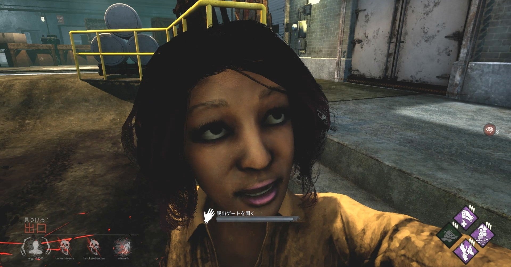

<figure>

</figure>

　この記事はまた『デッドバイデイライト』の話である。短く終わらせるつもりだ。

　『デッドバイデイライト』は、ゲーム内にボイスチャットなどは用意されていない。ロビーで待っている間は文字でチャットができるが、一旦ゲームが始まるとそれもできない。お互いのプレイヤーができるコミュニケーションは、指差しと、手招きの2種類だけ。現代のゲームとしては実にプアなコミュニケーションツールしか実装されていない。

　これは、4人いる生存者の仲間が、あまり濃密なコミュニケーションを取らないような配慮だ。殺人鬼1人に対し、4人の生存者で脱出を目指す『デッドバイデイライト』の場合、その4人がボイスチャットなどで結託すると、非常に強力なコンビネーションを発揮してしまう。1人しかいない殺人鬼は圧倒的に不利なわけだ。

　そんなわけで、『デッドバイデイライト』におけるコミュニケーションツールは非常に貧弱だ。しかし、これが逆に楽しい。

　僕はフレンドと『デッドバイデイライト』を遊ぶ際、ボイスチャットを使うこともあるが、基本はそういう外部のチャットを使わず、野良で遊ぶのと同じ感覚でフレンドと遊んでいる。だから、たとえ気心の知れたフレンドと言えども、お互いに意思の疎通ができているとは言い難い。

　先日は、僕が徹底して殺人鬼から隠れて（隠密プレイなどと呼ばれる）、のらりくらりとゲームをプレイしていたのだが、後からフレンドがYoutubeにアップした動画を見たら、彼はものすごい勢いで殺人鬼と追いかけっこをして、その間にフレンドである僕がゲームの目的である「発電機の修理」を進めてくれているに違いないと思っていたようだ。

　残念ながら、そのとき僕は殺人鬼に隠れまくって、むしろフレンドが活躍してくれるだろうと、非常にぬるいプレイをしていた。まあ、ちょっと迷惑な仲間と言えなくもないが、この意思の疎通のできないゲームシステムが最近はすごく楽しく感じている。お互いの考えがわからないがために、ぜんぜん期待と違う動きを仲間がしているのは、思わず吹き出してしまうようなおかしさがあるのだ。

　しかし、それでいて、本当にピンチになったときには颯爽と救助に登場するフレンド。なんか、ヒーロー的な趣があってかっこいい。そういうところもすごく楽しいゲームだと思っている。

　うーん、しかし、もしかしたらそう思っているのは自分だけなのかもしれない。人と人との考えの齟齬がおもしろい瞬間と思ってしまうのは、万人に共通する感覚じゃないだろう。

　そんなことも考えながら『デッドバイデイライト』をやっている。哲学的で深い。

[https://www.youtube.com/watch?v=TXA4ijm8ldI](https://www.youtube.com/watch?v=TXA4ijm8ldI)
