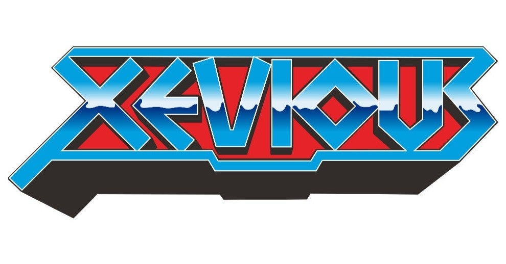

<figure>

</figure>

　久々に**『ゼビウス』**をプレイしていた。このゲームはいつプレイしても自分の若き日が思い起こされる。僕自身、ゲームをプレイすることでこんなノスタルジーを感じる日が来るなんて想像もしていなくて、なんだかちょっと可笑しいような不思議な気分だ。

　イトーヨカドーのゲームコーナーで初めて見た**『ゼビウス』**は、鮮やかな森の緑と、キラキラと輝くシルバーの敵キャラが印象的だった。あまりたくさんの色が使われていないのに、そのコントラストだけで実に色彩豊かなゲームのように感じられた。多くの敵キャラは、明滅する赤い信号のようなものを持ち、それもシルバーとの対比で美しく見えた。何ひとつ説明されてはいないが、そのデザインだけですごくSF的な世界観を感じ取ることができた。

　きっとこのゲームはおもしろい。それが、**『ゼビウス』**と初めてであったときの感想である。実際、100円を投入してプレイした**『ゼビウス』**は初めて体験する楽しさに満ちていた。驚くべきことに、スクロールする画面には、次々と異なる地形が現れ、真っ先に目を引いた緑色の森以外にも、広大な海や、荒涼とした砂漠（しかも地上絵まである！）と、戦いの舞台が多彩に描かれていたのだ。

　こうなってくると、先が見たい一心でプレイのモチベーションは急上昇する。先に進むに連れ、新たな敵キャラが現れ、地上を行き来する車両（？）はより凝った動きをするようになる。そして、何回目かのプレイで、ついに画面を覆い尽くさんばかりの巨大なキャラクター、アンドアジェネシスの姿を見ることになる。今思えば全然画面を覆い尽くしていないのだが、初めてアンドアジェネシスを見たときは、そのインパクトに画面いっぱいに見えたのだ。アンドアジェネシスは画面に出現すると同時に、ゴゴゴゴ……と重低音の振動を発し、木製のミディ筐体（初めて出会った**『ゼビウス』**はテーブル筐体ではなかった！）はその効果音で震えていた。本当に迫力あるボス演出だ。

　衝撃的な出会いからほどなく、**『ゼビウス』**にはソルやスペシャルフラッグという隠れキャラが存在することも風のうわさに聞こえてきた。ある日ゲーセンで、人のプレイする**『ゼビウス』**を見ていると、なにもない地面や海にブラスターを撃ち込んでいる。地面から生えるように出現するソルに驚いた。まだまだこんな謎が隠されているなんて！　その奥の深さに感嘆するばかりだった。

　その後、雑誌で**『ゼビウス』**のキャラクターやストーリーが紹介されると、その人気はさらに加速する。ゲームブックが発売され、史上初のゲームミュージックサントラが登場する事態にもなった。ビデオゲームの歴史においてもエポックメイキングだったんじゃないだろうか。

　そんな**『ゼビウス』**も発売から38年。今では、昔の有名なビデオゲームのひとつというぐらいの認識だろう。でも、僕はあの時代に、確かに**『ゼビウス』**の世界に入り込み、その神秘に包まれた世界に生きていたのだ。今はもう思い出の中に埋もれているけど、強烈なインプリンティングだけは心の底に残っている。それだけは、はっきりと言える。

[https://www.youtube.com/watch?v=nsLtOKtgqyo](https://www.youtube.com/watch?v=nsLtOKtgqyo)
