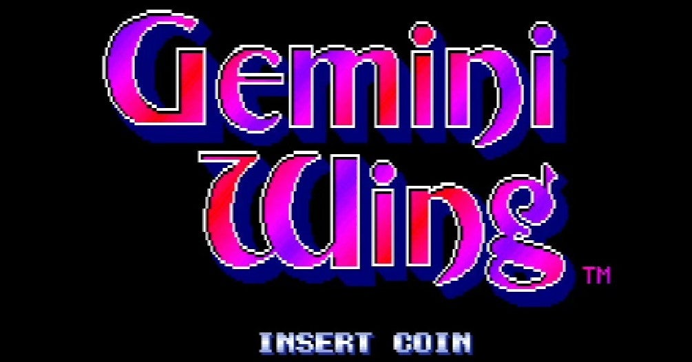
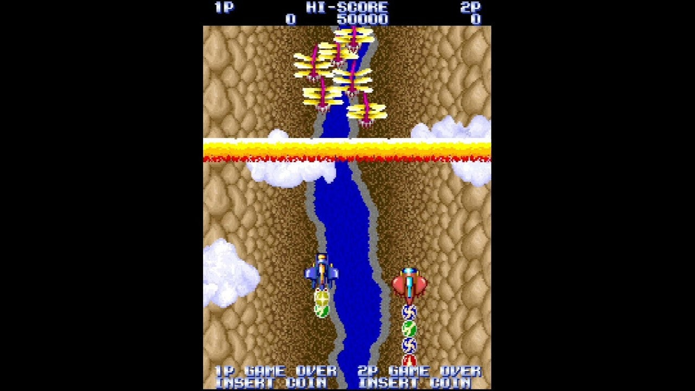

<figure>

</figure>

　テクモの縦スクロールシューティングゲーム**『ジェミニウイング』**の話題。今日、PS4と任天堂スイッチのアーケードアーカイブスに**『ジェミニウイング』**がラインナップされた。

　このゲームを初めて知ったのは、雑誌**『ログイン』**だったような気がする。アーケードゲームを紹介しているページで、新作として掲載されていた。しかし、なぜか近所のゲーセンにはなかなか入荷せず、あまり見なかった。雑誌で**『ジェミニウイング』**を知ってから、プレイするまでには結構な日にちを要した。

　もっとも当時は、アーケードゲームが次から次へと発売されるような状況だったので、よほど気になるゲームでもない限りは、入荷が遅くてもほとんど気にならなかった。**『ジェミニウイング』**もそんな感じだ。

そう思うと、**『シルクワーム』**とか**『雷牙』**も入荷が遅かった。**『忍者龍剣伝』**も一部のゲーセンにしか置いてなかった。もっともあれは特殊コンパネが災いしたのもあるかのかもしれない。もっと後になると**『がんばれギンくん』**もあまり見なかった気がする。

　テクモがテーカンだった時代にはそんなことはなく、**『プレアデス』**も**『レッドクラッシュ』**も**『SENJYO』**も**『スターフォース』**も**『ボンジャック』**もよく見かけた。トラックボールが必要な**『テーカンワールドカップ』**や、特殊コンパネの**『ピンボールアクション』**もアトラクト音をゲーセンに響かせていた。

　とにかく、そんな感じであまり見かけなかった**『ジェミニウイング』**。プレイする機会も少なく、タイトルとしてはそれなりに有名なのに、僕にとっては今ひとつマイナーなゲームなのだ。こうして、自宅で遊べるようになって（X68000用の移植はあったけど）、思う存分プレイできるのは僥倖。今から全ステージを拝んでみたい。

　ちなみに、**『ジェミニウイング』**の音楽はあの**メタルユーキ**こと斎藤幹雄のペンによるもの。僕の好きな曲調で、FM音源の音色はちょっと眠たいけど、なかなかドラマティックなBGMが楽しめる。

