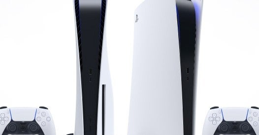
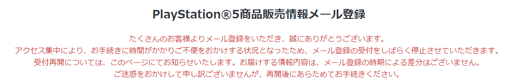

<figure>

</figure>

　奥さんが使っているPS4が、ピーピー音とともにディスクを吐き出す困ったちゃんモードになってしまったようだ。なんか静電気がたまると起きるとか、ネットに色んな情報があるものの、適当な自分修理をしてごまかすより、新品を1台買ってしまいたい。

　そう思ってネットを物色したが、まったくない。PS4が売っていない。ノーマルなPS4はもちろん、PS4 Proも売ってない。一体どういうことなんだ。

　一時期、ゲーム機が売れまくって店頭から消えたなんて話もあったが、未だに品薄は解消していないらしい。しかしこれは、PS5の発売を目前に控えて、PS4を売らない作戦なのかもしれない。どうやら、PS5にはPS4の互換機能もあるという話だから、メーカーとしてもPS4買うならPS5買わせたいだろう。

　さすがに互換機能上ではPS4 Pro相当なんだろうな、と思いつつ、それじゃあPS5の予約情報メールに登録しようと、ソニーのサイトを開いた。PlayStation IDでも登録できるが、ソニーIDでも登録できるらしい。古くはCLIEやREADERも買っていたぐらいだから、ソニーIDも持っている。いくらでも登録するよ、とばかりにサイトを開いた。

　なんと、申し込みが殺到してサーバ混雑により、現在は予約情報メールに登録できないとのこと。ソニーはダメな企業に成り果てたとは思っていたけど、ここまでしょうもないとは思わなかった。本当にがっかりした。

　あと、ソニーのゲーム機の最初期ロットは書いたくないのも正直なところ。PSもPS2もPS3も初期ロットで壊れたからね。PS4は初期じゃないけど壊れた。日本の技術力、地に落ちたり。こんなもん？

