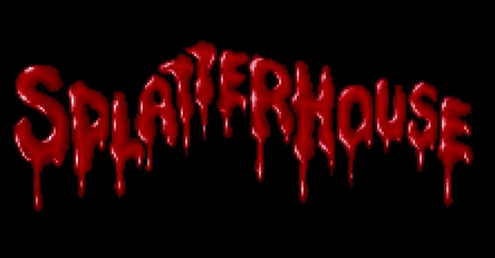

<figure>

</figure>

　**『スプラッターハウス』**は、ナムコが1988年にアーケード用として発売したゲームだ。その名の通り、スプラッタームービーのような世界観を表現したホラーアクションゲームだ。

　主人公リックとその恋人ジェニファーが雨宿りした山中の館で怪異に襲われ、リックは、奇怪な仮面の力を借りて化け物にさらわれてしまったジェニファーを探すことになる。デモ画面を見ていると、そんなストーリーのようだ。これはあくまで想像。詳細なストーリーが語られないところはいかにも昔のゲームという感じで潔い。

　リックはホッケーマスクをかぶって館の中を進んでいくのだが、その姿や、チェーンソーを持った凶悪な敵、ポルターガイスト現象などなど、いかにもホラー映画に登場しそうなギミックがアクションゲームの肝となっている。しかし、ドット絵で描かれたクリーチャーたちは、あくまでホラーな姿をしているものの、どこかコミカルで楽しげだ。あまりグロさがないところがとっつきやすい要因の一つかもしれない。

　FM音源によるBGMも、決して何かのホラー映画の真似ではないものの、しっかり恐怖演出を作り出していて見事だ。今聞いても楽しめる楽曲がそろっている。

　80年代は、**『エルム街の悪夢』『死霊のはらわた』『フェノミナ』**などなど、血がドバーッと出るいわゆるスプラッタームービーが流行った。このゲームも、そんなところから**『スプラッターハウス』**というタイトルがつけられたに違いない。

　しかしながら、このゲームの中で描かれるホラー要素は、もう少し古いホラー映画、たとえば**『ハロウィン』**や**『13日の金曜日』**などの70年代ホラーに近い気がする。僕自身、そんな70年代のホラー映画が大好きなので、**『スプラッターハウス』**で遊んだ当時、一発で気に入ってしまった。

　実際にプレイしてみると、**『スプラッターハウス』**は難易度が低く、しかも1周エンドなので実に気軽に遊べるコンパクトな作品だ。今でも、ときどき遊びたくなる。

　もし今遊ぶとすれば、幸いなことに任天堂スイッチ用に**『ナムコミュージアム』**の収録作品をプレイすることができる。過去には、PCエンジン用の、多少省略されながらもかなりアーケード版に忠実に移植があった。また、XBOX360では、3Dアクションにリメイクされた同名ゲームがリリースされたが、その中のおまけ要素として遊ぶこともできた。

　あまりメジャーになりきれなかったタイトルなだけに、移植も少なく、あまり遊ばれていないゲームかもしれないが、ホラー映画、ホラーゲーム好きの僕にとっては、忘れられない名作だ。

[https://www.youtube.com/watch?v=1cH92GPlW2c](https://www.youtube.com/watch?v=1cH92GPlW2c)
