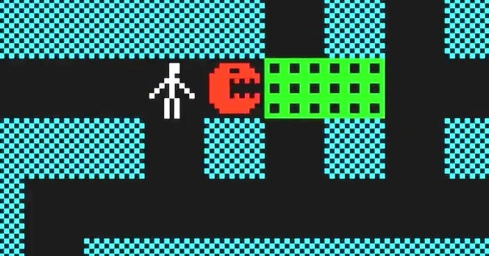

<figure>

</figure>

　『BUG FIRE!』は工学社のパソコン雑誌1981年3月号に、読者投稿プログラムとして掲載されたアクションゲームだ。

　プレイヤーは、上下左右にスクロールする巨大な迷路の中を走り回り、罠を仕掛ける。罠にかかった真っ赤な悪いパックマンみたいな顔のバグをハンマーで叩き潰し、殲滅することが目的のゲームだ。

　PC-8001は、1979年に発売されたパソコン（当時はマイコンと呼ばれていたけど）で、グラフィックの解像度が160x100ドットと、今からすると極めてチープなスペックしかない。CPUはZ80互換のμPD780C-1を4MHzで駆動しており、お世辞にも速いとは言えない。しかし、『BUG FIRE!』はそんなPC-8001上で非常に高速で動作しているゲームだった。ある意味、当時のゲーマーにとって憧れだったアーケードゲームのようなスピード感を実現しているゲームだ。

[https://www.youtube.com/watch?v=OdijCDBozLQ](https://www.youtube.com/watch?v=OdijCDBozLQ)

　完全オリジナルのゲームデザインも新鮮だったし、数分でプレイできるコンパクトさも非常に遊びやすかった。作者は、当時東大PCユーザーグループの雄城嘉史氏。誌面の記事には、プログラムの解説も詳細に書かれており、グラフィックの描画が、ビットマップ領域と色を制御するアトリビュート領域に分かれているPC-8001でどのようにカラフルなグラフィックの高速スクロールを実現しているかについても言及されている。当時、こういう技術的な記事を読むのがすごく楽しくて、読み耽ってしまったものだ。なお、プログラムは細分化・構造化を考慮し、その上で各ルーチンをハンドアセンブルしているということらしい。この時代にすごいことだ。

　作者の雄城嘉史氏は、他にもPC-8001用のゲームとして『STAR FIRE』『スタートレック・ファイア』など、いくつかゲームを発表しているが、どれもマシン語で作られた高速な動作を実現しており、非常に楽しく遊べるものばかりだった。

　グラフィックこそ低解像度だが今見ても迫力ある画面は、ゲームに時代は関係ないと思わせる凄さがある。こういうシンプルで楽しいゲームを今の時代にもまた、遊びたいものである。

[https://www.youtube.com/watch?v=OW1PmNozx9I](https://www.youtube.com/watch?v=OW1PmNozx9I)
