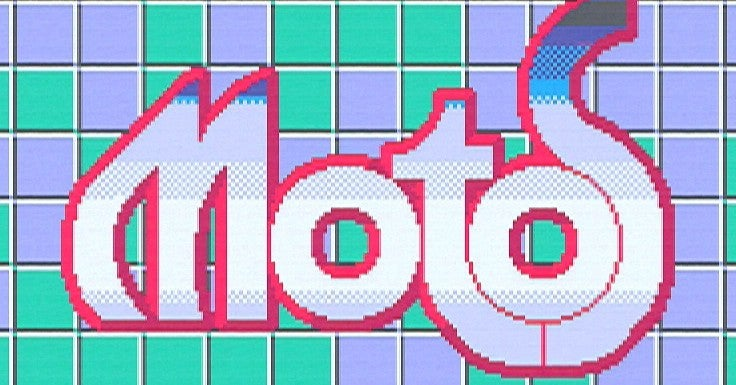
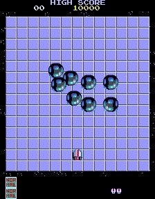

<figure>

</figure>

　『モトス』はナムコが1985年に発売したアーケードゲーム。宇宙に浮かぶステージ上でモータースパナーという自機を操り、多彩な敵キャラとぶつかり合って、宇宙空間に相手を落とすのが目的という一風変わったゲームだ。

　このゲームに出会ったのは、普段毎日のように通っていた近所の半地下ゲーセンだ。ここはナムコのゲームがいち早く入荷するので、当時ナムコ好きだった僕にとって、お気に入りのゲーセンだった。

　今のようにネットもなく、アーケードゲーム雑誌もほとんどなかった時代、新作ゲームの情報を知るのは、いつもゲーセンの店頭だった。『モトス』も、ある日突然お気に入りのゲーセンに入荷していた。

　金属的な質感を持ったキャラクタが目まぐるしく動き回る画面が印象的で、しかしそれまでに出会ったことのないゲームシステムが新鮮だった。一見してこのゲームはなんだろうと思わせるものの、デモ画面をちょっと見るだけで、何をすればいいのかわかるというのが秀逸だ。相手をタイル状の盤面から落とす。それだけでいいということがすぐに伝わってくるゲームだった。

　実際にプレイしてみると、これが難しい。まず、敵の動きが速すぎる。自機をぶつけて落としてやろうとしても、トリッキーな動きで盤面を駆け回り、無理な突進を行えば、自分が勢い余ってステージから飛び降りるような結果になりかねない。それでいて、敵キャラは盤面ギリギリを走っても落ちないのだからズルい。（実際は、敵キャラも失敗して落下することが後にわかるのだが）

　ステージをクリアして先に進むと、あきらかに重量のある敵が現れる。こちらがいくらぶつかってもびくともせず、でかい面して盤面に居座るのだ。（顔はないけど）こういう重量級の敵には、特定のステージで入手した、自機の質量をアップするパワーパーツの装備が必要だ。見た目に変化はないものの、ずっしりと重くなった自機は、重量級の敵にも押し負けない。さっきまであっけなく宇宙空間に放り出されていたのが、今度は逆に相手を押し出していけるようになる。『モトス』は、この辺の重量感の表現が、キャラクターの動きだけでわかるようになっていて見事だった。

　こうして、しばらく『モトス』をプレイしていた僕だったが、気づけば、僕以外に誰もこのゲームを遊んでいなかった。その難易度の高さと、コンティニューがないことが災いして、人を寄せ付けないゲームになっていたのだ。僕自身も、一向に先の面に進むことができなくなっていた。そしてある日、あまり人気のなかった『モトス』は突如ゲーセンから姿を消した。世間一般には、あまりメジャーとはいい難いゲームだったのだ。

　それから四半世紀。もはやゲーセンに風変わりなゲームが置かれなくなった頃、僕は『モトス』の基板を手に入れた。しかし、100円を入れないからと言って、この難敵がクリアできるわけもなかった。仕方なく僕は、『モトス』の基板から外したプログラムROMをリバースエンジニアリングして、コンティニュー機能をつけてみた。ちょっとズルをしたが、21世紀に入ってようやく自分の手で（？）エンディングを見ることができたというわけだ。

[http://keigox68000.hatenablog.com/entry/20110601/p1](http://keigox68000.hatenablog.com/entry/20110601/p1)

