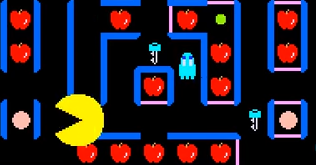

<figure>

</figure>

　『スーパーパックマン』は、ナムコが1982年にリリースしたアーケードゲームだ。1980年の『パックマン』の大ヒットにあやかろうと、二匹目のドジョウをねらった作品であることは言うまでもない。

　しかし、この『スーパーパックマン』、さっぱりヒットしなかった。おそらくそんなゲームが存在したことすら知らない人も多いのではないか。それぐらい流行っていなかった。（ように見えた）

　それでも僕は『パックマン』より『スーパーパックマン』の方が断然好きだった。『スーパーパックマン』には、食べるとパワーアップして、モンスターたちを食べることができるパワーエサ（クッキー？）もあったが、それとは別に、食べるとパックマンが巨大化して無敵化、さらにはボタンを押すことでパックマンがスピードアップするスーパーエサが存在した。これが実に気持ちいいのだ。

　『スーパーパックマン』の特徴として、迷路内に扉に閉ざされた通路があり、対応する鍵を食べないと扉が開かないというものがあった。これがゲームを難しくしていたのだが、スーパーエサで巨大化すると、この扉すら破壊して進むことができた。とにかく、スーパーエサを取ったときの傍若無人ぶりがすごくて、そこが気に入っていたのだ。

　しかし、この二重パワーアップのわかりにくさ。扉を開くというギミックの面倒くささが災いしたのか、『スーパーパックマン』はさっぱりプレイされていなかった。スピードアップしたパックマンの操作も簡単ではなかったし、何よりも、わずか2年で、時代が『パックマン』から離れていたのかもしれない。

　このスピーディで軽快なプレイ感を持つパックマンが、再びどこかで復活してくれることを願う。ナムコは、自社の古いゲームの移植についてはもうひとつ消極的なのが残念だ。
