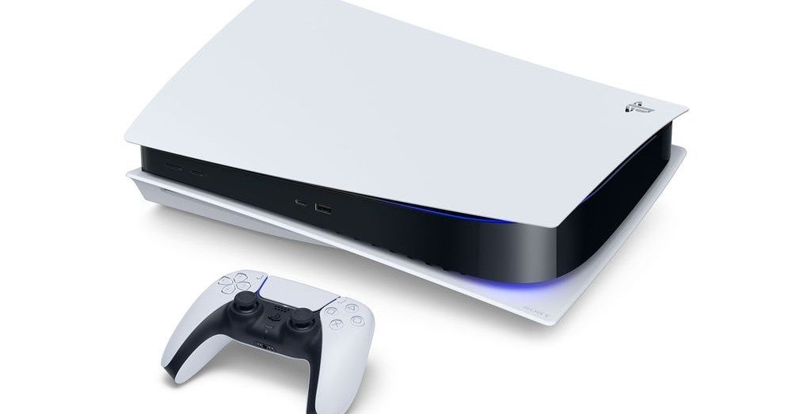

<figure>

</figure>

　昼休みにツイッターのタイムラインを眺めていたら、PS5の価格が発表になったという情報が流れてきた。ドライブ付きのモデルが49,980円、ドライブなしが39,980円だそうだ。

[https://www.famitsu.com/news/202009/17205918.html](https://www.famitsu.com/news/202009/17205918.html)

　正直言って、PS3の6万円とかPS4の4万円とかが記憶にあるので、すごく安いと思う。個人的には8万円ぐらいで出てくるんじゃないかと思っていたぐらいだ。

　ライバル機種の価格が先出しで来ていただけあって、SIEがんばったなという感じはある。こういうもののコストってよくわからないけど、赤字覚悟と言われれば、そうだろうなあと納得してしまう。

　発売も11月12日ということで、割と間近に迫っている印象だ。今回の発表はかなりインパクトをもたせることに成功したのではないだろうか。

　じゃあ、僕も早速予約するかと言うと、実は様子見しようと思っている。これまで、初代PSに始まり、PS2、PS3と初期型を購入してきているが、どれも一様に壊れているからだ。もちろん、機械はいずれ壊れるものだが、これだけ初期型故障にぶち当たっていると、さすがに警戒するようになる。PS4も初期型は避けた。

　一方で、ドライブがなければ故障率も低いのかもしれないと、ちょっと期待している部分はある。実際PS4では、ディスクのソフトはわずか数本しか買っていない。こだわっていたわけではないが、いつの間にかダウンロードソフトを買う習慣が身についていしまっているからだ。これは以前noteにも書いた。

　気になるのは、PS4との互換性。別に後方互換が必ずしも必要とは思っていないが、あれば便利だ。日常的に遊ぶことが多いアーケードアーカイブスみたいなコンパクトなゲームが、最新のPS5でも遊べるなら、これは願ってもないゲーム環境だ。いや、その前に最新機種で80年代アーケードゲームやるのかよ、という突っ込みはあるのだが。

　そんなわけで、あまり慌てずにPS5の動向を見守っている。気が向いたら買うことにしよう。

　それより、本体デカすぎないか？ もはやPCケースにも迫る巨大な筐体、しかもヘンテコな形状をしたPS5にちょっと恐怖を感じてさえいる。存在感ありすぎ。
