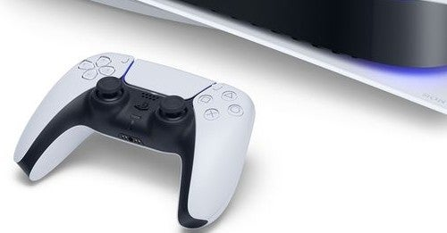

<figure>

</figure>

　仕事終わってツイッター見たら、今日の日中は阿鼻叫喚だったみたいだ。PS5があちこちで予約終了して、みんな絶望にまみれていたよ。

　さらには、すでに転売でAmazonマーケットプレイスに何台もPS5が並んでいる状態。まだ発売していないのに。しかも、中には間違えて購入することを狙って、価格を一桁多く設定している転売屋もいる始末。Amazonが市場に登場してきたことで、我々の世界は正常な商取引のできない時代に突入したようだ。いかに早く商品を手に入れ、いかにそれをうまく売り抜けるかの競争が横行する世紀末の様相を呈している。もう世紀末は過ぎたというのにだ。

　もはや、Amazon自体が害悪でしかないのだが、これは今回のPS5に限らない。今日はたまたまゲーミングマウスを検索してみたのだが、同じモデルが複数出品されていて、価格も送料もすべて設定が違う。サクラによる高評価もにぎやかに花を咲かせ、もはやものを買う場としては機能しなくなっている。そろそろ、みんなこれに嫌気が差して脱Amazonするんじゃないかと思っている。まだ少し時間がかかりそうではあるが。

　それはさておき、PS5だ。あまり興味がなくて積極的に情報を仕入れていないので、ローンチタイトルがなんなのかよくわかっていない。『デモンズソウル』は一発目に来るのだろうか？　PS4との互換は結局どうなのか？　いろいろなことが見えてきていない。だから、PS5が予約できない状況も、高みの見物で「大変だねえ」ぐらいの感じで見ている。大変だねえ。

　先日はゲームギアのちっこいやつが予約できないとかでネット上が騒がしかった。みんな、欲しいおもちゃが次々と発売されるので、それを手に入れるので必死だ。本当に大変だと思う。

　かく言う自分も、どうしても物をためこんでしまうタイプなので、他山の石として、物欲だけで生きることのないように気をつけている。最近は物欲よりも、いかに人生を生きるかの方が大切だとつくづく感じてさえいる。

　さて、PS5が発売されるというだけで、この騒ぎ。そして考えさせられる世の中の動き。すべてのものは業が深く、そして人生に思いを致す豊富な材料である。実に勉強になるなあ。そして、みんなPS5が買えるといいね。そんなことを思っていた。
